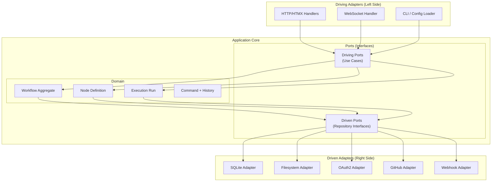
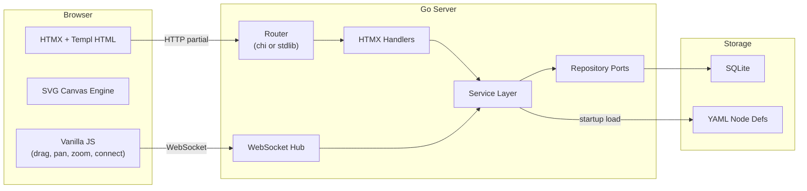
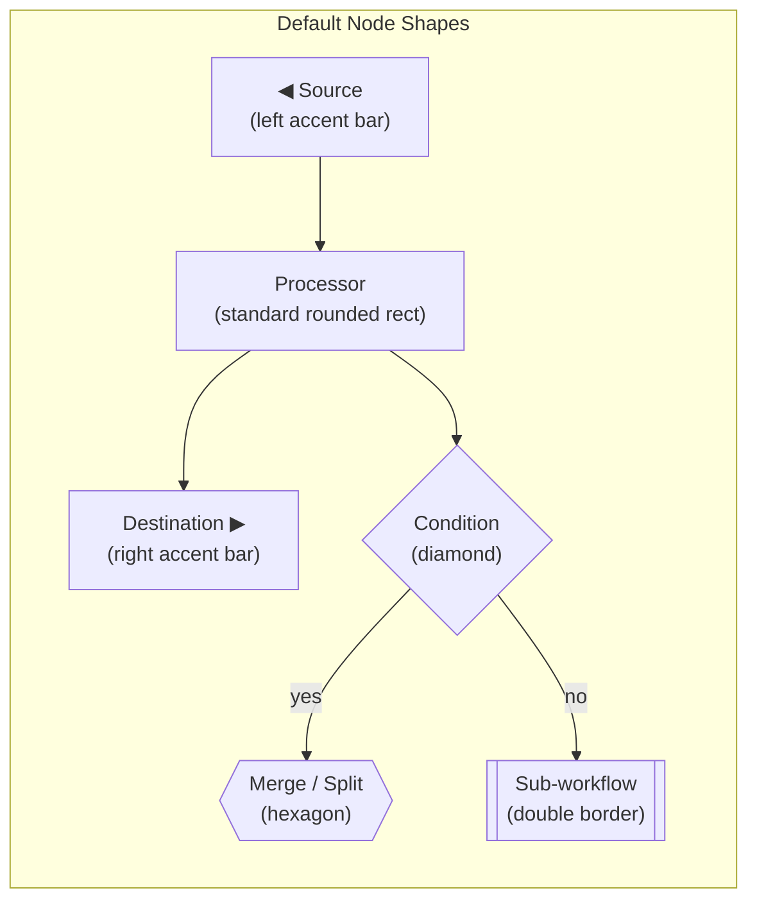
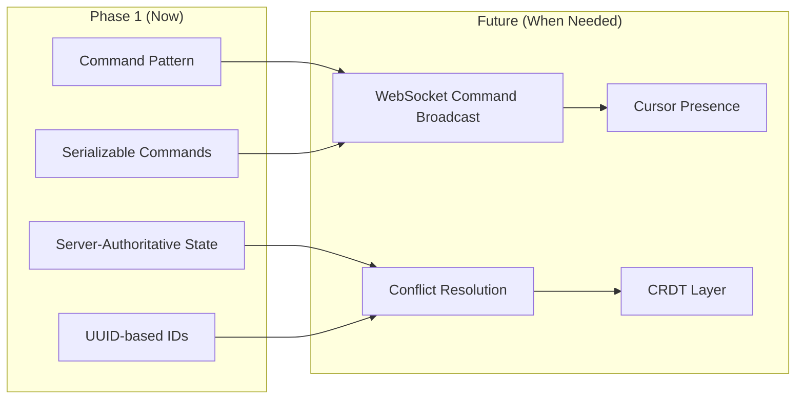
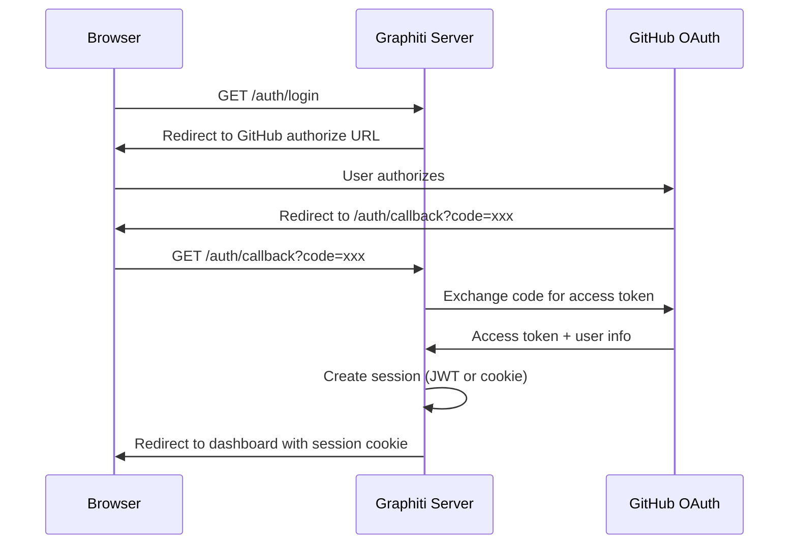
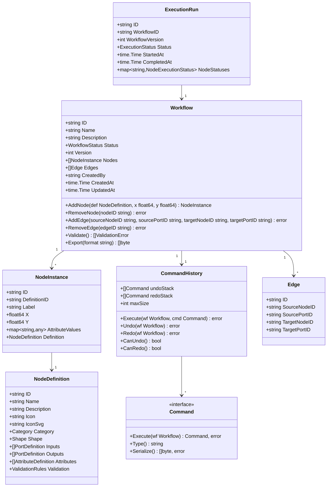

# Graphiti: Open Source Visual Workflow Builder

## Product Requirement Specification (PRS)

**Version:** 0.1.0-draft
**Date:** 2026-03-09
**Status:** Draft for Architecture Review

## 1. Executive Summary

Graphiti is a standalone, open-source visual workflow builder UI. Think of it as a "canvas where you wire up building blocks." Each block (a node) represents a step in a workflow, like a source that pulls data in, a processor that transforms it, or a destination that sends it somewhere. Users drag nodes from a palette, drop them onto a canvas, draw connections between them, configure each node's settings, and then deploy the whole thing.

The project is deliberately decoupled from any specific backend execution engine. It's the cockpit, not the engine. A separate project will handle workflow execution. Graphiti handles definition, visualization, deployment signaling, and execution monitoring.

The tech stack is intentionally lean: Go for the backend, HTMX + Templ for server-driven UI, SVG for the node rendering system, and a thin layer of vanilla JavaScript for canvas interactions (drag, pan, zoom, connection drawing, undo/redo, clipboard).

### 1.1 Project Goals

1. **Standalone UI library** that any workflow engine can integrate with
2. **YAML-driven node registry**, so developers define node types, shapes, ports, and categories in config files rather than code
3. **SVG-based node rendering** that scales to large workflows (hundreds of nodes) without DOM performance collapse
4. **Hexagonal architecture** with every domain boundary behind a port/adapter interface
5. **Command Pattern** for all canvas mutations, enabling undo/redo from day one and creating the foundation for future collaborative editing
6. **Test-driven development** as a first-class practice, not an afterthought
7. **Light/Dark/System theme support** defaulting to light mode
8. **Sub-workflow support** built in from day one
9. **OAuth2 integration** with GitHub as the reference implementation
10. **Stateless execution engine integration** via versioned webhook payloads, no message broker required

### 1.2 What Graphiti Is Not

- It is not a workflow execution engine. It produces workflow definitions (JSON/YAML) and delivers them to an external engine via versioned webhook.
- It is not a general-purpose diagramming tool. It's opinionated toward directed workflow graphs.
- It is not a SaaS product. It's a library/framework meant to be embedded or self-hosted.
- It does not require a message broker. Deploy integration is a simple HTTP webhook, keeping the dependency footprint minimal.

## 2. Terminology

| Term | Definition |
|---|---|
| **Node** | A visual block on the canvas representing a single workflow step. Has typed input/output ports. |
| **Port** | A connection point on a node. Ports are typed (e.g., `data`, `control`, `error`) and directional (input or output). |
| **Edge** | A connection line drawn between an output port of one node and an input port of another. |
| **Workflow** | A directed graph of nodes and edges that defines a complete pipeline. |
| **Sub-workflow** | A workflow embedded inside a single node, allowing composition and reuse. |
| **Node Definition** | A YAML configuration that declares a node type's shape, ports, attributes, category, and validation rules. |
| **Canvas** | The central SVG-based area where the user builds and views workflows. |
| **Node Registry** | The in-memory collection of all available node definitions, loaded from YAML at startup. |
| **Command** | A serializable object representing a single canvas mutation. Every user action (add node, move, connect, etc.) is captured as a Command. |
| **Command History** | The undo/redo stack that records Commands and enables reversing or replaying mutations. |
| **Clipboard** | A serialized subgraph (nodes + internal edges) stored temporarily for copy/paste operations. |
| **Deploy** | The act of publishing a workflow definition via versioned webhook to an execution engine. |
| **Execution Run** | A single invocation of a deployed workflow, tracked with status per node. |

## 3. Architecture Overview

### 3.1 Hexagonal Architecture

The system is structured as concentric layers. The innermost layer knows nothing about the outside world, and every outer layer communicates inward through interfaces (ports). Picture it like a medieval castle: the keep (domain) doesn't care whether the outer wall is made of stone or wood, it just knows there's a wall.



### 3.2 High-Level Component Map



### 3.3 Technology Choices

| Layer | Technology | Rationale |
|---|---|---|
| Backend language | Go 1.22+ | Strong stdlib, single binary deploys, excellent concurrency |
| Templating | Templ | Type-safe Go templates, compiles to Go code, pairs naturally with HTMX |
| Server-driven UI | HTMX | Minimal JS, HTML-over-the-wire, progressive enhancement |
| Node rendering | SVG (inline in DOM) | Resolution-independent, CSS-stylable, lightweight for graph rendering |
| Canvas interactions | Vanilla JS (~800-1200 LOC) | Drag-and-drop, pan/zoom, edge drawing, selection, undo/redo dispatch, clipboard. No framework overhead. |
| Real-time updates | WebSocket | Execution status streaming, collaborative editing (future) |
| Persistence | SQLite (reference) | Zero-config, embedded, good enough for single-node deploys |
| Configuration | YAML | Human-readable, widely understood, easy to version control |
| Auth | OAuth2 (OIDC) | Industry standard, GitHub as sample provider |
| Testing | Go `testing` + testify | TDD, table-driven tests, interface mocking |

## 4. YAML Node Definition System

### 4.1 Design Philosophy

Node definitions are the "DNA" of the system. Every node type that appears in the palette, that can be dragged onto the canvas, is declared in YAML. The developer never writes Go code to add a new node type. They write a YAML file, drop it in a directory, and restart (or hot-reload).

Think of it like a recipe card system: each YAML file is a recipe card that tells Graphiti what the node looks like, what plugs it has, and what options the user can tweak.

### 4.2 Node Definition Schema

```yaml
# example: nodes/sources/twilio.yaml
apiVersion: graphiti/v1
kind: NodeDefinition

metadata:
  id: source-twilio
  name: Twilio
  description: "Receives call recording callbacks from Twilio"
  version: "1.0.0"
  icon: "T"                          # Short text label for the node badge
  iconSvg: |                         # Optional: custom SVG icon (24x24 viewBox)
    <svg viewBox="0 0 24 24">...</svg>

category:
  group: Sources                     # Top-level palette group
  order: 20                          # Sort order within the group

shape:
  type: rounded-rect                 # One of: rounded-rect, pill, diamond, hexagon, parallelogram, custom
  width: 200                         # Default width in px
  minWidth: 160
  maxWidth: 320
  headerColor: "var(--cyan)"         # CSS variable or hex
  headerBackground: "var(--cyan-dim)"
  customSvg: null                    # If shape.type is "custom", provide full SVG template here

ports:
  inputs: []                         # Sources have no inputs
  outputs:
    - id: out-main
      label: "Output"
      type: data                     # Port type: data | control | error
      position: right-center         # Anchor: right-center | right-top | right-bottom | bottom-center
      maxConnections: -1             # -1 = unlimited

attributes:
  - id: endpoint
    label: "Endpoint"
    type: string
    default: "/ingest/twilio"
    required: true
    display: node-body               # Where to show: node-body | config-panel | both
    group: "Connection"

  - id: format
    label: "Audio Format"
    type: enum
    options: ["wav", "mp3", "ogg", "flac"]
    default: "wav"
    display: node-body
    group: "Connection"

  - id: stir_shaken
    label: "STIR/SHAKEN Verification"
    type: boolean
    default: true
    display: both
    group: "Security"

  - id: api_key
    label: "Twilio Auth Token"
    type: secret
    required: true
    display: config-panel
    group: "Authentication"
    hint: "Use ${TWILIO_AUTH_TOKEN} for env var reference"

validation:
  connectionRules:
    - outputPort: out-main
      allowedTargetCategories: ["Processing", "Destinations"]
      allowedTargetPorts: ["data"]

  # Optional: custom validation expression
  attributeRules:
    - expression: "endpoint.startsWith('/')"
      message: "Endpoint must start with /"
```

### 4.3 Node Definition Directory Structure

```
config/
  nodes/
    sources/
      twilio.yaml
      zoom.yaml
      email-imap.yaml
    processing/
      transcribe.yaml
      summarize.yaml
      pii-redaction.yaml
      sign-jws.yaml
    destinations/
      amazon-s3.yaml
      postgresql.yaml
      webhook.yaml
    control/
      condition.yaml       # If/else branching
      loop.yaml            # Iteration
      sub-workflow.yaml    # Embeds another workflow
      merge.yaml           # Fan-in from multiple branches
      split.yaml           # Fan-out to multiple branches
  themes/
    light.yaml
    dark.yaml
  workflows/               # Saved workflow definitions
    example-pipeline.yaml
```

### 4.4 Default Shape Set

Each category of node gets a default visual shape. Developers can override per-node, but these defaults give users instant visual cues about what a node does, the same way traffic signs use shape to convey meaning before you even read the text.

| Category | Default Shape | Visual Rationale |
|---|---|---|
| Sources | Rounded rectangle, left edge emphasized | Data flows "out" from the right side. Left edge has a colored accent bar. |
| Processors / Transforms | Standard rounded rectangle | The "workhorse" shape, neutral and flexible |
| Destinations / Sinks | Rounded rectangle, right edge emphasized | Data flows "in" from the left. Right edge has a colored accent bar. |
| Control Flow (Condition) | Diamond | Universal flowchart convention for decisions |
| Control Flow (Merge/Split) | Hexagon | Visually distinct from data nodes, suggests "junction" |
| Sub-workflow | Double-bordered rounded rectangle | The double border signals "there's more inside," like a folder icon |
| Error Handler | Rounded rectangle with dashed border | Dashed border signals "exceptional path" |



### 4.5 Custom SVG Shapes

For cases where the default shapes don't fit, developers can supply a custom SVG template in the node definition:

```yaml
shape:
  type: custom
  customSvg: |
    <g class="node-shape" data-node-id="{{.ID}}">
      <rect x="0" y="0" width="{{.Width}}" height="{{.Height}}"
            rx="10" ry="10"
            class="node-bg" />
      <rect x="0" y="0" width="{{.Width}}" height="36"
            rx="10" ry="0"
            class="node-header-bg" />
      <!-- Port anchors are placed by the engine based on port definitions -->
    </g>
```

The SVG template uses Go template syntax. The rendering engine injects the node's runtime dimensions, ID, and theme variables. Port circles, labels, and attribute displays are layered on top by the engine, not by the custom SVG.

## 5. User Interface Specification

### 5.1 Layout Structure

The UI follows a three-panel layout inspired by the Faktotum mockup, with a top navigation bar.

```
┌────────────────────────────────────────────────────────────────┐
│  Top Navigation Bar                                            │
│  [Logo] [Breadcrumb] .............. [YAML] [Settings] [Deploy▾]│
├──────────┬────────────────────────────────────┬────────────────┤
│          │                                    │                │
│  Left    │       Center Canvas                │   Right        │
│  Panel   │       (SVG Workspace)              │   Panel        │
│  260px   │       (flexible)                   │   300px        │
│          │                                    │                │
│          │                                    │                │
│          │                                    │                │
│          │                                    │                │
│          │  [Stats Bar]       [Zoom Controls] │                │
├──────────┴────────────────────────────────────┴────────────────┤
│  [Builder Mode] [Execution Mode]  (tab bar, below top nav)    │
└────────────────────────────────────────────────────────────────┘
```

### 5.2 Top Navigation Bar

**Components:**

- **Logo and version badge** (left-aligned)
- **Breadcrumb:** Shows current navigation path, e.g., `/ Workflows / Support Call Pipeline`
- **Action buttons** (right-aligned):
  - `YAML` button: Opens raw YAML view of the current workflow
  - `Settings` button: Opens global settings modal
  - `Deploy` button (primary, blue): Deploys the current workflow. Includes a dropdown chevron with options:
    - "Deploy to Production"
    - "Deploy to Staging"
    - "Save as Draft"
    - "Export as YAML"
    - "Export as JSON"

### 5.3 Mode Tabs

A tab bar sits directly below the top navigation, offering two modes:

| Mode | Left Panel | Center Canvas | Right Panel |
|---|---|---|---|
| **Builder** | Node palette (categories, search) | Interactive SVG canvas (drag, connect, configure) | Node configuration form |
| **Execution** | Execution history list | Read-only workflow view with status overlays | Selected node execution details |

### 5.4 Left Panel: Builder Mode (Node Palette)

**Header:** "Components" label, uppercase, muted color

**Search:** Full-width text input with placeholder "Search components..." that filters across all categories in real-time. Search matches against node name, description, and category.

**Category Groups:** Each group is collapsible with a click/tap on the group title.

- Group title: uppercase, small, muted (e.g., "SOURCES", "PROCESSING", "DESTINATIONS", "CONTROL FLOW")
- Each node item shows:
  - Colored icon badge (30x30px rounded square, background tinted per category)
  - Node name (12px, semibold)
  - Short description (10px, muted)
- Items are draggable (`cursor: grab`, `cursor: grabbing` on mousedown)

**HTMX behavior:** The initial palette is rendered server-side. Search input triggers `hx-get="/api/nodes/search?q=..."` with `hx-trigger="keyup changed delay:200ms"` and replaces the component list.

### 5.5 Left Panel: Execution Mode (Run History)

Replaces the node palette with a chronological list of execution runs:

- Each entry shows: Run ID (short hash), timestamp, duration, status badge (success/failed/running/cancelled)
- Clicking a run loads its execution graph into the center canvas
- Entries are paginated, loaded via HTMX scroll trigger

### 5.6 Center Canvas

The canvas is the heart of Graphiti. It's a single large SVG element with nested `<g>` groups for layers.

**SVG Layer Stack (bottom to top):**

1. **Grid layer:** Dot grid pattern via SVG `<pattern>`, provides spatial reference
2. **Edge layer:** All connection lines (SVG `<path>` elements using cubic Bezier curves)
3. **Node layer:** All node groups (SVG `<g>` per node, containing shape, ports, labels, attribute previews)
4. **Interaction layer:** Drag preview ghosts, selection rectangles, in-progress connection lines
5. **HUD layer:** Minimap (future), stats bar, zoom controls

**Canvas Interactions (vanilla JS):**

| Interaction | Behavior |
|---|---|
| Drag from palette | Ghost node follows cursor, snaps to grid on drop, triggers `AddNodeCommand` |
| Click node | Selects it, highlights border, loads config in right panel via `hx-get` |
| Drag node on canvas | Updates position via `MoveNodeCommand` |
| Drag from output port | Draws temporary Bezier curve following cursor. On release over valid input port, triggers `AddEdgeCommand` |
| Click edge | Selects it, shows delete option |
| Delete key | Removes selected node or edge via `RemoveNodeCommand` / `RemoveEdgeCommand` |
| Scroll wheel | Zoom in/out (CSS `transform: scale()` on the canvas content group) |
| Middle-click drag or Space+drag | Pan the canvas (CSS `transform: translate()`) |
| Double-click node | Opens inline rename for the node instance label |
| Ctrl/Cmd + click | Multi-select nodes |
| Drag selection box | Multi-select nodes within the rectangle |
| Ctrl/Cmd + Z | Undo last canvas mutation |
| Ctrl/Cmd + Shift + Z | Redo last undone mutation |
| Ctrl/Cmd + C | Copy selected nodes and internal edges to clipboard |
| Ctrl/Cmd + X | Cut selected nodes (copy + delete, single undoable command) |
| Ctrl/Cmd + V | Paste clipboard at cursor position with new IDs and remapped edges |
| Ctrl/Cmd + D | Duplicate selection in place (offset by 24px diagonally) |

**Stats Bar:** Floating bar at bottom center showing aggregate counts: number of sources, processors, destinations, and (in execution mode) throughput and success rate.

**Zoom Controls:** Floating buttons at bottom right: zoom in (+), zoom out (-), fit-to-view (⊞).

### 5.7 Right Panel: Builder Mode (Configuration)

When a node is selected on the canvas, the right panel shows its configuration form.

**Tabs along the top of the panel:**

- **Configure** (default): Shows the node's configurable attributes, grouped by the `group` field from the YAML definition
- **Logs:** Shows recent log entries for this node type (placeholder for execution integration)
- **YAML:** Shows the raw YAML for this node instance's configuration

**Configuration form rendering:**

Each attribute from the node definition generates a form field based on its `type`:

| Attribute Type | Rendered As |
|---|---|
| `string` | Text input |
| `text` | Textarea (multi-line) |
| `number` | Number input with optional min/max |
| `boolean` | Toggle switch |
| `enum` | Dropdown select |
| `secret` | Password input with "show" toggle, hint about env var syntax |
| `json` | Code editor textarea with monospace font |
| `expression` | Code input with monospace font and syntax hint |
| `port-mapping` | Dynamic key-value list for port routing |

All form changes are saved via HTMX `hx-patch` requests with `hx-trigger="change"` or debounced `keyup`.

### 5.8 Right Panel: Execution Mode (Node Details)

When viewing an execution run and a node is highlighted:

- **Status:** Badge showing pass/fail/skipped/running
- **Timing:** Start time, end time, duration
- **Input data:** Collapsed JSON viewer showing what the node received
- **Output data:** Collapsed JSON viewer showing what the node produced
- **Error:** If failed, the error message and stack trace
- **Logs:** Scrollable log output from this node's execution

### 5.9 Deploy Button Behavior

The Deploy button in the top navigation works as follows:

- **Default action (click the button itself):** Deploys to the default environment (configurable)
- **Dropdown arrow (click the chevron):** Opens a dropdown menu with deployment options:
  - "Deploy to Production": Publishes the workflow definition and signals the execution engine
  - "Deploy to Staging": Publishes to a staging target
  - "Save as Draft": Persists the current state without deploying
  - "Export as YAML": Downloads the workflow as a `.yaml` file
  - "Export as JSON": Downloads the workflow as a `.json` file
- **Visual feedback:** After deploy, the button briefly flashes green and shows a checkmark. On failure, it flashes red with an error toast.

### 5.10 Theme System

Graphiti supports three theme modes: Light, Dark, and System (follows OS preference). Light is the default.

**Implementation:** CSS custom properties (variables) defined in `:root` and toggled via a `data-theme` attribute on `<html>`. The YAML theme files (`config/themes/light.yaml`, `config/themes/dark.yaml`) define the variable values, which are compiled into CSS at build time or served dynamically.

**Theme variables (subset):**

| Variable | Light Value | Dark Value |
|---|---|---|
| `--bg` | `#F8F9FB` | `#0C0F14` |
| `--surface` | `#FFFFFF` | `#151921` |
| `--surface-2` | `#F1F3F5` | `#1C2230` |
| `--border` | `#E2E5EA` | `#2A3345` |
| `--text` | `#1A1D23` | `#E8ECF1` |
| `--text-muted` | `#6B7280` | `#8892A4` |
| `--accent` | `#3B82F6` | `#3B82F6` |
| `--node-source` | `#0891B2` | `#06B6D4` |
| `--node-processor` | `#9333EA` | `#A855F7` |
| `--node-destination` | `#D97706` | `#F59E0B` |
| `--node-control` | `#059669` | `#10B981` |

**Theme toggle:** Located in the Settings modal or as a small icon in the top navigation bar. Persisted in localStorage (client-side) and optionally in user preferences (server-side).

## 6. SVG Rendering Engine

### 6.1 Why SVG Over Canvas/WebGL

The choice of SVG over HTML5 Canvas or WebGL is deliberate. Think of it like choosing between a vector illustration program and a raster paint program:

- **SVG elements are DOM nodes.** They can be styled with CSS, targeted by selectors, and (critically) manipulated with HTMX via `hx-swap="outerHTML"`. A Canvas pixel blob can't do any of that.
- **SVG scales to any zoom level** without blurring.
- **Accessibility:** SVG elements can have `aria-label`, `role`, and can be navigated by assistive technology.
- **Performance at scale:** For workflow graphs up to 500+ nodes, SVG performs well. The browser's layout engine handles hit-testing and repaints efficiently when nodes are grouped properly.

### 6.2 SVG Structure for a Single Node

```xml
<g class="node" data-node-id="node-123" transform="translate(400, 200)">
  <!-- Drop shadow filter -->
  <filter id="shadow-node-123">
    <feDropShadow dx="0" dy="2" stdDeviation="4" flood-opacity="0.15"/>
  </filter>

  <!-- Node body shape -->
  <rect class="node-bg" x="0" y="0" width="200" height="120"
        rx="10" ry="10" filter="url(#shadow-node-123)" />

  <!-- Header background -->
  <rect class="node-header-bg" x="1" y="1" width="198" height="36"
        rx="10" ry="10" />
  <!-- Clip the header bottom corners to be square -->
  <rect class="node-header-mask" x="1" y="20" width="198" height="17" />

  <!-- Icon badge -->
  <rect class="node-icon-bg" x="10" y="8" width="22" height="22" rx="4" />
  <text class="node-icon-text" x="21" y="24" text-anchor="middle">Tx</text>

  <!-- Title -->
  <text class="node-title" x="40" y="24">Transcribe</text>

  <!-- Status badge -->
  <rect class="node-badge-bg" x="145" y="11" width="46" height="16" rx="8" />
  <text class="node-badge-text" x="168" y="22" text-anchor="middle">Active</text>

  <!-- Attribute rows -->
  <g class="node-body" transform="translate(0, 40)">
    <text class="attr-key" x="12" y="14">Provider</text>
    <text class="attr-value" x="188" y="14" text-anchor="end">deepgram</text>
    <line class="attr-divider" x1="10" y1="20" x2="190" y2="20" />
    <!-- ... more attributes ... -->
  </g>

  <!-- Input port -->
  <circle class="port port-in" cx="0" cy="60" r="5"
          data-port-id="in-main" data-port-type="data" />

  <!-- Output port -->
  <circle class="port port-out" cx="200" cy="60" r="5"
          data-port-id="out-main" data-port-type="data" />
</g>
```

### 6.3 Edge Rendering

Edges between nodes are drawn as SVG `<path>` elements using cubic Bezier curves. The curve's control points are calculated based on the positions of the source and target ports to create a smooth, natural-looking connection.

```xml
<path class="edge"
      data-edge-id="edge-456"
      data-source-node="node-123" data-source-port="out-main"
      data-target-node="node-789" data-target-port="in-main"
      d="M 400,260 C 450,260 480,340 530,340"
      fill="none"
      stroke="var(--accent)"
      stroke-width="2"
      marker-end="url(#arrowhead)" />
```

### 6.4 Performance Strategy for Large Workflows

When a workflow grows to hundreds of nodes, we use several strategies to keep things smooth:

1. **Viewport culling:** Only render SVG elements for nodes visible in the current viewport. Nodes outside the view are replaced with lightweight placeholder `<rect>` elements.
2. **Level-of-detail:** At low zoom levels (zoomed out far), nodes simplify to colored rectangles without text or attribute rows. Ports become invisible. This dramatically reduces the number of text layout calculations.
3. **Batched DOM updates:** Position changes during drag operations are batched using `requestAnimationFrame` rather than updating on every mousemove event.
4. **Edge path caching:** Bezier curve path strings (`d` attribute) are recalculated only when connected nodes move, not on every render frame.

## 7. Command Pattern, Undo/Redo, and Clipboard

### 7.1 Design Decision: Command Pattern from Day 1

Every mutation to the workflow canvas flows through a Command object. This isn't optional and it isn't a "nice to have." Canvas tools without undo/redo feel broken to users, and retrofitting a command log into a system built on scattered direct state changes is one of the most painful refactors in UI engineering. It's like trying to add a foundation to a house that's already standing.

The Command Pattern also buys us a second, equally important benefit: it creates the natural on-ramp for collaborative editing later (see Section 7.5).

### 7.2 Command Interface

Every canvas mutation implements this interface:

```go
// domain/command.go

type Command interface {
    // Execute applies the mutation and returns the inverse command for undo
    Execute(wf *Workflow) (Command, error)

    // Type returns a string identifier for serialization (e.g., "add_node", "move_node")
    Type() string

    // Serialize converts the command to JSON for clipboard, network sync, or audit logging
    Serialize() ([]byte, error)
}
```

The key insight: `Execute` returns the inverse command. When you add a node, `Execute` returns a "remove node" command. When you move a node from position A to B, `Execute` returns a "move node from B to A" command. This keeps undo logic local to each command rather than in a central undo manager.

### 7.3 Command Types

| Command | Fields | Inverse |
|---|---|---|
| `AddNodeCommand` | definitionID, x, y, instanceID | `RemoveNodeCommand` |
| `RemoveNodeCommand` | nodeID, serializedNode | `AddNodeCommand` (with full state) |
| `MoveNodeCommand` | nodeID, fromX, fromY, toX, toY | `MoveNodeCommand` (swapped) |
| `MoveNodesCommand` | []nodeID, []fromPos, []toPos | `MoveNodesCommand` (swapped) |
| `AddEdgeCommand` | sourceNodeID, sourcePortID, targetNodeID, targetPortID | `RemoveEdgeCommand` |
| `RemoveEdgeCommand` | edgeID, serializedEdge | `AddEdgeCommand` (with full state) |
| `UpdateAttributeCommand` | nodeID, attrID, oldValue, newValue | `UpdateAttributeCommand` (swapped) |
| `PasteNodesCommand` | []serializedNodes, []serializedEdges, offsetX, offsetY | `RemoveNodesCommand` (batch) |
| `RenameNodeCommand` | nodeID, oldLabel, newLabel | `RenameNodeCommand` (swapped) |

### 7.4 Undo/Redo Stack

```go
// domain/history.go

type CommandHistory struct {
    undoStack []Command   // Commands that can be undone
    redoStack []Command   // Commands that were undone and can be redone
    maxSize   int         // Maximum stack depth (default: 100)
}

func (h *CommandHistory) Execute(wf *Workflow, cmd Command) error {
    inverse, err := cmd.Execute(wf)
    if err != nil {
        return err
    }
    h.undoStack = append(h.undoStack, inverse)
    h.redoStack = nil // Any new action clears the redo stack
    if len(h.undoStack) > h.maxSize {
        h.undoStack = h.undoStack[1:]
    }
    return nil
}

func (h *CommandHistory) Undo(wf *Workflow) error {
    if len(h.undoStack) == 0 {
        return ErrNothingToUndo
    }
    cmd := h.undoStack[len(h.undoStack)-1]
    h.undoStack = h.undoStack[:len(h.undoStack)-1]
    inverse, err := cmd.Execute(wf)
    if err != nil {
        return err
    }
    h.redoStack = append(h.redoStack, inverse)
    return nil
}
```

Keyboard shortcuts: Ctrl/Cmd+Z for undo, Ctrl/Cmd+Shift+Z (or Ctrl+Y) for redo. Both trigger `POST /api/workflows/{id}/undo` or `POST /api/workflows/{id}/redo`, which return the updated SVG fragment for the affected region of the canvas.

### 7.5 Copy, Paste, and Duplicate

Users will inevitably select a group of carefully configured nodes and want to duplicate them. This requires serializing a subgraph to JSON, generating fresh IDs on paste, and remapping all internal edges so the pasted group is self-consistent but disconnected from the original.

**Clipboard serialization format:**

```json
{
  "version": 1,
  "source": "graphiti",
  "nodes": [
    {
      "originalID": "node-123",
      "definitionID": "processing-transcribe",
      "label": "Transcribe",
      "relativeX": 0,
      "relativeY": 0,
      "attributes": { "provider": "deepgram", "model": "nova-2" }
    },
    {
      "originalID": "node-456",
      "definitionID": "processing-summarize",
      "label": "Summarize",
      "relativeX": 260,
      "relativeY": 0,
      "attributes": { "provider": "anthropic", "model": "claude-sonnet" }
    }
  ],
  "edges": [
    {
      "sourceOriginalID": "node-123",
      "sourcePortID": "out-main",
      "targetOriginalID": "node-456",
      "targetPortID": "in-main"
    }
  ]
}
```

Node positions in the clipboard are stored relative to the top-left corner of the selection bounding box. On paste, the group is placed at the cursor position (or offset by 24px diagonally if pasting in place).

**ID remapping on paste:** The server generates new UUIDs for every pasted node. A mapping table (`oldID -> newID`) rewrites all edge references in the pasted group. Edges that referenced nodes outside the copied group are dropped silently, since the user is copying a subgraph, not the whole workflow.

**Operations:**

| Action | Shortcut | Behavior |
|---|---|---|
| Copy | Ctrl/Cmd+C | Serializes selected nodes and their internal edges to clipboard JSON. Sent to server via `POST /api/workflows/{id}/clipboard/copy`. |
| Cut | Ctrl/Cmd+X | Copy + delete selected nodes (as a single undoable command). |
| Paste | Ctrl/Cmd+V | Sends clipboard JSON to `POST /api/workflows/{id}/clipboard/paste` with target position. Server generates new IDs, remaps edges, returns new SVG fragments. |
| Duplicate | Ctrl/Cmd+D | Shorthand for Copy + Paste-in-place. Single undoable command. |

All clipboard operations are implemented as Commands and are fully undoable.

### 7.6 Collaborative Editing: Architectural Decision

**Decision: Architect for collaboration now, build it later.**

The Command Pattern gives us about 60% of the infrastructure that CRDTs (Conflict-free Replicated Data Types) would need. Every canvas mutation is already a serializable, ordered command object. The remaining leap, conflict resolution and real-time network sync, is genuinely hard, but it layers on top of a command log rather than replacing something structural.

Here's what we're doing now to keep the door open:

1. **All commands are serializable.** Every Command can round-trip through JSON. This means we can transmit them over WebSocket later without redesigning the data structures.
2. **Commands carry enough context to resolve conflicts.** Each command includes both old and new values (not just "set X to 5" but "change X from 3 to 5"). This is the prerequisite for operational transform.
3. **The command history lives in domain, not in JS.** Server-authoritative state means we avoid the nightmare of reconciling two divergent client-side histories.
4. **Node IDs are UUIDs, not sequential.** Two users can create nodes simultaneously without ID collisions.

Here's what we're explicitly deferring:

1. Real-time cursor presence ("Alice is editing node X")
2. WebSocket broadcast of commands to other connected clients
3. Conflict resolution when two users edit the same node attribute simultaneously
4. CRDT data structures for the workflow graph

The expected effort to add collaboration later, given this foundation, is roughly one focused sprint (2-3 weeks) for basic presence and command broadcast, plus another sprint for conflict resolution. Without the Command Pattern, you'd be looking at a multi-month rewrite.



## 8. Sub-Workflow System

### 8.1 Concept

A sub-workflow node is a special node type that contains an entire workflow inside it. Visually, it looks like a regular node with a double border. When the user double-clicks it, the canvas "zooms into" the sub-workflow, replacing the current canvas content with the inner graph. A breadcrumb trail in the top nav shows the nesting path.

### 8.2 YAML Definition

```yaml
apiVersion: graphiti/v1
kind: NodeDefinition

metadata:
  id: control-sub-workflow
  name: Sub-workflow
  description: "Embeds a reusable child workflow"
  icon: "⧉"

category:
  group: Control Flow
  order: 50

shape:
  type: sub-workflow           # Double-bordered rounded rect
  width: 220

ports:
  inputs:
    - id: in-main
      label: "Input"
      type: data
      position: left-center
  outputs:
    - id: out-main
      label: "Output"
      type: data
      position: right-center
    - id: out-error
      label: "Error"
      type: error
      position: bottom-center

attributes:
  - id: workflow_ref
    label: "Referenced Workflow"
    type: workflow-reference    # Special type: shows a workflow picker
    required: true
    display: config-panel
    group: "Workflow"

  - id: input_mapping
    label: "Input Mapping"
    type: json
    display: config-panel
    group: "Data Mapping"

  - id: output_mapping
    label: "Output Mapping"
    type: json
    display: config-panel
    group: "Data Mapping"
```

### 8.3 Navigation

- Double-click a sub-workflow node to navigate into it
- Breadcrumb updates to show the path, e.g., `/ Workflows / Main Pipeline / Data Enrichment (sub)`
- A "Back" button or breadcrumb click navigates back to the parent
- The inner workflow has its own independent node palette, canvas, and config panel

## 9. Authentication and Integration

### 9.1 OAuth2 Architecture

Authentication is handled via an adapter that implements the `AuthProvider` port interface. The system supports multiple OAuth2 providers, with GitHub as the reference implementation.



### 9.2 Auth Port Interface

```go
// ports/auth.go
type AuthProvider interface {
    // GetAuthURL returns the OAuth2 authorization URL
    GetAuthURL(state string) string

    // ExchangeCode exchanges an authorization code for tokens
    ExchangeCode(ctx context.Context, code string) (*TokenPair, error)

    // GetUserInfo retrieves user profile from the provider
    GetUserInfo(ctx context.Context, accessToken string) (*UserInfo, error)

    // RefreshToken refreshes an expired access token
    RefreshToken(ctx context.Context, refreshToken string) (*TokenPair, error)
}

type TokenPair struct {
    AccessToken  string
    RefreshToken string
    ExpiresAt    time.Time
}

type UserInfo struct {
    ID        string
    Username  string
    Email     string
    AvatarURL string
    Provider  string
}
```

### 9.3 GitHub Reference Implementation

The `GitHubAuthAdapter` implements `AuthProvider` and is included as the sample integration. It handles:

- OAuth2 authorization code flow
- Token exchange and refresh
- User profile retrieval via GitHub API
- Organization membership checks (optional, for access control)

Configuration in `config/auth.yaml`:

```yaml
auth:
  provider: github
  github:
    clientId: "${GITHUB_CLIENT_ID}"
    clientSecret: "${GITHUB_CLIENT_SECRET}"
    scopes: ["user:email", "read:org"]
    allowedOrgs: []             # Empty = no org restriction
  session:
    secret: "${SESSION_SECRET}"
    maxAge: 86400               # 24 hours
    secure: true                # HTTPS-only cookies
```

## 10. Execution Engine Contract

### 10.1 Design Decision: Versioned Webhook Payload

Graphiti communicates with external execution engines through a single mechanism: a versioned webhook. When a user deploys a workflow, Graphiti pushes a JSON payload to a configured HTTP endpoint. That's it. No shared message queue, no RabbitMQ, no Kafka. This is deliberate.

An open-source tool should have the lowest possible barrier to "try it out." Requiring users to spin up a message broker just to see the Deploy button work is a fast way to lose them. A webhook is universal: every language, every framework, every cloud provider can receive an HTTP POST. If a team later wants to put a queue between Graphiti and their engine, they can point the webhook at a thin proxy that publishes to whatever queue they prefer.

### 10.2 Deploy Webhook Payload Schema

```json
{
  "apiVersion": "graphiti/v1",
  "event": "workflow.deployed",
  "timestamp": "2026-03-09T14:30:00Z",
  "deployment": {
    "id": "deploy-abc123",
    "target": "production",
    "triggeredBy": {
      "userID": "user-xyz",
      "username": "alice"
    }
  },
  "workflow": {
    "id": "wf-001",
    "name": "Support Call Pipeline",
    "version": 5,
    "definition": {
      "nodes": [
        {
          "id": "node-123",
          "definitionID": "source-twilio",
          "label": "Twilio",
          "x": 100,
          "y": 200,
          "attributes": {
            "endpoint": "/ingest/twilio",
            "format": "wav"
          }
        }
      ],
      "edges": [
        {
          "id": "edge-456",
          "sourceNodeID": "node-123",
          "sourcePortID": "out-main",
          "targetNodeID": "node-789",
          "targetPortID": "in-main"
        }
      ]
    }
  },
  "previousVersion": 4,
  "checksum": "sha256:a1b2c3..."
}
```

The `apiVersion` field lets engines handle payload evolution gracefully. The `checksum` field lets engines verify the payload wasn't tampered with in transit (HMAC signing is supported via a shared secret).

### 10.3 Webhook Configuration

```yaml
# In config/app.yaml
deploy:
  defaultTarget: production
  hmacSecret: "${DEPLOY_HMAC_SECRET}"    # Shared secret for payload signing
  targets:
    production:
      webhookURL: "${DEPLOY_WEBHOOK_PROD}"
      timeout: 30s
      retries: 3
      retryBackoff: exponential          # 1s, 2s, 4s
    staging:
      webhookURL: "${DEPLOY_WEBHOOK_STAGING}"
      timeout: 30s
      retries: 3
      retryBackoff: exponential
```

### 10.4 Webhook Adapter Interface

```go
// ports/driven/deploy_target.go

type DeployTarget interface {
    // Deploy sends the workflow definition to the execution engine
    Deploy(ctx context.Context, payload DeployPayload) (*DeployResult, error)
}

type DeployPayload struct {
    APIVersion      string
    Event           string
    Timestamp       time.Time
    DeploymentID    string
    Target          string
    TriggeredBy     UserInfo
    Workflow        WorkflowExport
    PreviousVersion int
    Checksum        string
}

type DeployResult struct {
    Accepted    bool
    Message     string
    EngineRunID string  // Optional: if the engine returns a run ID immediately
}
```

The webhook adapter handles HMAC signing, retries with exponential backoff, and timeout enforcement. If the engine returns a run ID in its response, Graphiti stores it and uses it to correlate execution status updates received via WebSocket.

### 10.5 Execution Status Callback (Engine to Graphiti)

The execution engine can push status updates back to Graphiti via a callback webhook or WebSocket:

```json
{
  "apiVersion": "graphiti/v1",
  "event": "execution.node_status",
  "runID": "run-789",
  "workflowID": "wf-001",
  "nodeID": "node-123",
  "status": "completed",
  "startedAt": "2026-03-09T14:30:01Z",
  "completedAt": "2026-03-09T14:30:03Z",
  "outputSummary": { "recordsProcessed": 42 }
}
```

This lets the Execution Mode canvas update node status overlays in real-time.

## 11. Persistence Layer

### 11.1 Repository Port Interfaces

All persistence is behind port interfaces. The domain never knows whether it's talking to SQLite, PostgreSQL, or a flat file.

```go
// ports/repository.go

type WorkflowRepository interface {
    Create(ctx context.Context, wf *domain.Workflow) error
    GetByID(ctx context.Context, id string) (*domain.Workflow, error)
    List(ctx context.Context, filter WorkflowFilter) ([]*domain.WorkflowSummary, error)
    Update(ctx context.Context, wf *domain.Workflow) error
    Delete(ctx context.Context, id string) error
    GetVersionHistory(ctx context.Context, id string) ([]*domain.WorkflowVersion, error)
}

type NodeDefinitionRepository interface {
    LoadAll(ctx context.Context) ([]*domain.NodeDefinition, error)
    GetByID(ctx context.Context, id string) (*domain.NodeDefinition, error)
    GetByCategory(ctx context.Context, category string) ([]*domain.NodeDefinition, error)
    Search(ctx context.Context, query string) ([]*domain.NodeDefinition, error)
}

type ExecutionRepository interface {
    Create(ctx context.Context, run *domain.ExecutionRun) error
    GetByID(ctx context.Context, id string) (*domain.ExecutionRun, error)
    ListByWorkflow(ctx context.Context, workflowID string, filter ExecutionFilter) ([]*domain.ExecutionRunSummary, error)
    UpdateNodeStatus(ctx context.Context, runID string, nodeID string, status domain.NodeExecutionStatus) error
    AppendNodeLog(ctx context.Context, runID string, nodeID string, entry domain.LogEntry) error
}

type UserRepository interface {
    Upsert(ctx context.Context, user *domain.User) error
    GetByID(ctx context.Context, id string) (*domain.User, error)
    GetByProviderID(ctx context.Context, provider string, providerID string) (*domain.User, error)
}
```

### 11.2 SQLite Reference Implementation

The SQLite adapter implements all repository interfaces. Tables:

```sql
CREATE TABLE workflows (
    id TEXT PRIMARY KEY,
    name TEXT NOT NULL,
    description TEXT,
    definition JSON NOT NULL,     -- Full workflow graph as JSON
    status TEXT DEFAULT 'draft',  -- draft | deployed | archived
    version INTEGER DEFAULT 1,
    created_by TEXT REFERENCES users(id),
    created_at DATETIME DEFAULT CURRENT_TIMESTAMP,
    updated_at DATETIME DEFAULT CURRENT_TIMESTAMP
);

CREATE TABLE workflow_versions (
    id TEXT PRIMARY KEY,
    workflow_id TEXT REFERENCES workflows(id),
    version INTEGER NOT NULL,
    definition JSON NOT NULL,
    deployed_at DATETIME,
    deployed_by TEXT REFERENCES users(id),
    created_at DATETIME DEFAULT CURRENT_TIMESTAMP
);

CREATE TABLE execution_runs (
    id TEXT PRIMARY KEY,
    workflow_id TEXT REFERENCES workflows(id),
    workflow_version INTEGER NOT NULL,
    status TEXT DEFAULT 'pending', -- pending | running | completed | failed | cancelled
    started_at DATETIME,
    completed_at DATETIME,
    trigger_type TEXT,             -- manual | webhook | schedule
    trigger_data JSON
);

CREATE TABLE execution_node_statuses (
    id TEXT PRIMARY KEY,
    run_id TEXT REFERENCES execution_runs(id),
    node_id TEXT NOT NULL,
    status TEXT DEFAULT 'pending', -- pending | running | completed | failed | skipped
    started_at DATETIME,
    completed_at DATETIME,
    input_data JSON,
    output_data JSON,
    error_message TEXT,
    logs JSON                      -- Array of log entries
);

CREATE TABLE users (
    id TEXT PRIMARY KEY,
    username TEXT NOT NULL,
    email TEXT,
    avatar_url TEXT,
    auth_provider TEXT NOT NULL,
    auth_provider_id TEXT NOT NULL,
    created_at DATETIME DEFAULT CURRENT_TIMESTAMP,
    last_login_at DATETIME,
    UNIQUE(auth_provider, auth_provider_id)
);
```

## 12. API Design

### 12.1 Endpoint Overview

All endpoints return either full HTML pages (for initial loads) or HTML fragments (for HTMX partial updates). JSON endpoints exist for the JS canvas interactions that need structured data.

**Page Routes (return full HTML):**

| Method | Path | Description |
|---|---|---|
| GET | `/` | Dashboard / workflow list |
| GET | `/workflows/{id}` | Workflow builder view |
| GET | `/workflows/{id}/execute` | Execution mode view |
| GET | `/auth/login` | Initiate OAuth2 login |
| GET | `/auth/callback` | OAuth2 callback handler |
| POST | `/auth/logout` | End session |

**HTMX Fragment Routes (return partial HTML):**

| Method | Path | Description |
|---|---|---|
| GET | `/api/nodes/search?q={query}` | Search node palette, returns HTML fragment |
| GET | `/api/nodes/category/{category}` | Get nodes by category, returns HTML fragment |
| GET | `/api/workflows/{id}/canvas` | Get full SVG canvas for a workflow |
| GET | `/api/workflows/{id}/nodes/{nodeId}/config` | Get config panel HTML for a node |
| PATCH | `/api/workflows/{id}/nodes/{nodeId}/config` | Update node config, returns updated node SVG + config panel |
| GET | `/api/workflows/{id}/executions` | Get execution history list HTML |
| GET | `/api/workflows/{id}/executions/{runId}` | Get execution detail HTML |

**JSON API Routes (for JS canvas engine):**

All canvas mutation endpoints accept and return Command objects. The server executes the command, pushes it onto the undo stack, and returns the affected SVG fragments.

| Method | Path | Description |
|---|---|---|
| POST | `/api/workflows/{id}/commands` | Execute a canvas command (add node, add edge, move, rename, etc.) |
| POST | `/api/workflows/{id}/undo` | Undo the last command, returns updated SVG fragments |
| POST | `/api/workflows/{id}/redo` | Redo the last undone command, returns updated SVG fragments |
| POST | `/api/workflows/{id}/clipboard/copy` | Serialize selected nodes and internal edges to clipboard JSON |
| POST | `/api/workflows/{id}/clipboard/paste` | Paste clipboard JSON at target position, returns new SVG fragments |
| POST | `/api/workflows/{id}/deploy` | Validate and deploy via webhook to configured target |
| GET | `/api/workflows/{id}/export?format={yaml\|json}` | Export workflow definition |

**WebSocket:**

| Path | Description |
|---|---|
| `ws:///api/ws/workflows/{id}` | Real-time updates: execution status, collaborative cursors (future) |

### 12.2 HTMX Interaction Patterns

**Node palette search:**
```html
<input type="text"
       name="q"
       class="search-box"
       placeholder="Search components..."
       hx-get="/api/nodes/search"
       hx-trigger="keyup changed delay:200ms"
       hx-target="#component-list"
       hx-swap="innerHTML" />
```

**Node selection (loads config panel):**
```html
<!-- Triggered by JS when user clicks a node on the SVG canvas -->
<div id="config-panel"
     hx-get="/api/workflows/{{.WorkflowID}}/nodes/{{.NodeID}}/config"
     hx-trigger="node-selected from:body"
     hx-swap="innerHTML">
</div>
```

**Config field update:**
```html
<input type="text"
       name="endpoint"
       value="/ingest/twilio"
       hx-patch="/api/workflows/{{.WorkflowID}}/nodes/{{.NodeID}}/config"
       hx-trigger="change, keyup changed delay:500ms"
       hx-include="closest .config-section"
       hx-swap="none" />
```

## 13. Domain Model

### 13.1 Core Entities



### 13.2 Workflow Validation Rules

The domain model enforces these invariants:

1. **Port type compatibility:** An edge can only connect an output port to an input port of the same type (e.g., `data` to `data`)
2. **Connection limits:** A port's `maxConnections` is respected. Input ports default to 1 connection. Output ports default to unlimited.
3. **Category restrictions:** Connection rules in the node definition can restrict which categories of nodes a port can connect to.
4. **Cycle detection:** The workflow graph must be a DAG (directed acyclic graph). The domain validates this before deployment. Sub-workflows are checked independently.
5. **Required attributes:** All attributes marked `required: true` must have non-empty values before deployment.
6. **Orphan detection:** Nodes with no connections are flagged as warnings (not errors).

## 14. Functional Stories with Acceptance Criteria

### Epic 1: Node Registry and Palette

**Story 1.1: Load node definitions from YAML**
> As a developer, I want to define node types in YAML files so that I can add new node types without writing Go code.

Acceptance Criteria:
- [ ] On startup, the server reads all `.yaml` files from the configured node definitions directory
- [ ] Each YAML file is parsed and validated against the node definition schema
- [ ] Invalid YAML files are logged as warnings but don't prevent startup
- [ ] Valid definitions are stored in the in-memory node registry
- [ ] A `GET /api/nodes/search` endpoint returns all registered nodes
- [ ] Node definitions include all fields: metadata, category, shape, ports, attributes, validation

**Story 1.2: Display categorized node palette**
> As a user, I want to see available nodes organized by category in the left panel so that I can quickly find the node I need.

Acceptance Criteria:
- [ ] The left panel displays nodes grouped under collapsible category headers
- [ ] Categories are sorted by the `order` field from YAML definitions
- [ ] Each node shows its icon, name, and short description
- [ ] Node icons use the category's color scheme (cyan for sources, purple for processors, orange for destinations, green for control flow)
- [ ] Categories default to expanded state
- [ ] Clicking a category header toggles its collapsed/expanded state
- [ ] Collapse state persists during the session

**Story 1.3: Search nodes in palette**
> As a user, I want to search for nodes by name or description so that I can find what I need without scrolling through categories.

Acceptance Criteria:
- [ ] A search input exists at the top of the node palette
- [ ] Typing filters the node list in real-time with a 200ms debounce
- [ ] Search matches against node name, description, and category name (case-insensitive)
- [ ] When a search query is active, category headers still appear but only for categories with matching nodes
- [ ] Clearing the search restores the full categorized view
- [ ] Search is performed server-side via HTMX partial update

### Epic 2: Canvas and Node Rendering

**Story 2.1: Render SVG canvas with grid**
> As a user, I want to see a dot-grid background on the canvas so that I have a spatial reference for placing nodes.

Acceptance Criteria:
- [ ] The center panel contains a full-size SVG element
- [ ] A dot grid pattern is rendered using SVG `<pattern>` with 24px spacing
- [ ] The grid is visible but subtle (low opacity)
- [ ] The grid scales and translates with pan/zoom

**Story 2.2: Drag node from palette to canvas**
> As a user, I want to drag a node from the palette and drop it onto the canvas so that I can add steps to my workflow.

Acceptance Criteria:
- [ ] Palette items have `cursor: grab` and become `cursor: grabbing` on mousedown
- [ ] Dragging a palette item creates a ghost preview that follows the cursor
- [ ] Dropping on the canvas dispatches an `AddNodeCommand` via `POST /api/workflows/{id}/commands`
- [ ] The server responds with the rendered SVG fragment for the new node
- [ ] The new node appears at the drop position, snapped to the nearest grid point
- [ ] Dropping outside the canvas area cancels the operation
- [ ] The node is assigned a unique instance ID and default attribute values
- [ ] The add operation is pushed onto the undo stack and is fully reversible

**Story 2.3: Render node shapes from definitions**
> As a user, I want nodes to have visually distinct shapes based on their category so that I can quickly identify what type of node I'm looking at.

Acceptance Criteria:
- [ ] Source nodes render with a left accent bar and rounded rectangle shape
- [ ] Processor nodes render as standard rounded rectangles
- [ ] Destination nodes render with a right accent bar and rounded rectangle shape
- [ ] Control flow condition nodes render as diamonds
- [ ] Merge/Split nodes render as hexagons
- [ ] Sub-workflow nodes render with a double border
- [ ] Custom SVG shapes defined in YAML are rendered correctly
- [ ] All nodes show their icon, title, status badge, and configured attributes
- [ ] Port circles are positioned according to the port definition's `position` field

**Story 2.4: Move nodes on canvas**
> As a user, I want to drag nodes to reposition them on the canvas so that I can organize my workflow layout.

Acceptance Criteria:
- [ ] Clicking and dragging a node moves it smoothly
- [ ] Node position is snapped to the grid when released
- [ ] Connected edges update their paths in real-time during the drag
- [ ] On release, a `MoveNodeCommand` (or `MoveNodesCommand` for multi-select) is dispatched to persist the new position
- [ ] Multi-selected nodes move together as a single undoable command

**Story 2.5: Pan and zoom the canvas**
> As a user, I want to pan and zoom the canvas so that I can navigate large workflows.

Acceptance Criteria:
- [ ] Mouse wheel zooms in and out, centered on cursor position
- [ ] Zoom range is limited to 25% through 200%
- [ ] Middle-click drag or Space+drag pans the canvas
- [ ] Zoom and pan are smooth (requestAnimationFrame)
- [ ] The zoom level is displayed somewhere visible
- [ ] Zoom control buttons (bottom right) work: +, -, fit-to-view
- [ ] Fit-to-view calculates the bounding box of all nodes and adjusts zoom/pan to show everything with padding
- [ ] Trackpad pinch-to-zoom is supported

**Story 2.6: Select nodes and edges**
> As a user, I want to select nodes and edges so that I can configure or delete them.

Acceptance Criteria:
- [ ] Clicking a node selects it and deselects everything else
- [ ] Selected node shows a highlighted border (accent color)
- [ ] Clicking the canvas background deselects everything
- [ ] Ctrl/Cmd+click adds or removes a node from the selection
- [ ] Drag-selecting draws a rectangle and selects all nodes within it
- [ ] Clicking an edge selects it (highlighted color, slightly thicker stroke)
- [ ] Pressing Delete or Backspace removes selected nodes and their connected edges
- [ ] A confirmation prompt appears before deleting nodes

### Epic 3: Connections (Edges)

**Story 3.1: Draw connections between nodes**
> As a user, I want to draw a line from one node's output to another node's input so that I can define the data flow.

Acceptance Criteria:
- [ ] Hovering over a port highlights it (border color changes, slight scale-up)
- [ ] Clicking and dragging from an output port starts drawing a temporary Bezier curve
- [ ] The curve follows the cursor and snaps to the nearest valid input port within a proximity threshold
- [ ] Releasing over a valid input port dispatches an `AddEdgeCommand` via `POST /api/workflows/{id}/commands`
- [ ] Releasing over an invalid target (wrong port type, already at max connections, or empty space) cancels the operation
- [ ] The new edge renders as a styled SVG path with an arrowhead marker
- [ ] Invalid connections show a visual "not allowed" indicator (red tint on the port)

**Story 3.2: Validate connections**
> As a user, I want the system to prevent me from making invalid connections so that my workflow is always structurally correct.

Acceptance Criteria:
- [ ] Connections are only allowed between matching port types (data-to-data, control-to-control, error-to-error)
- [ ] An input port that's already at max connections rejects new connections
- [ ] Connections that would create a cycle in the graph are rejected
- [ ] The node definition's `connectionRules` (allowed target categories) are enforced
- [ ] When dragging a connection, invalid ports appear dimmed or grayed out
- [ ] A tooltip briefly explains why a connection is invalid

**Story 3.3: Delete connections**
> As a user, I want to delete a connection between nodes so that I can restructure my workflow.

Acceptance Criteria:
- [ ] Clicking an edge selects it
- [ ] Pressing Delete removes the selected edge
- [ ] Right-clicking an edge shows a context menu with "Delete connection"
- [ ] Removing an edge dispatches a `RemoveEdgeCommand`
- [ ] The SVG path is removed from the canvas

### Epic 4: Node Configuration

**Story 4.1: Display node configuration panel**
> As a user, I want to see and edit a node's settings in the right panel when I select it so that I can configure how each step works.

Acceptance Criteria:
- [ ] Selecting a node loads its configuration in the right panel via HTMX
- [ ] The panel header shows the node's icon and title
- [ ] Attributes are grouped by the `group` field and rendered under section headers
- [ ] Each attribute is rendered as the correct form field type (text, dropdown, toggle, etc.)
- [ ] Current values are pre-populated from the node instance
- [ ] Changing a value auto-saves via HTMX PATCH with debounce
- [ ] Required fields are marked with an indicator
- [ ] The "Logs" and "YAML" tabs are accessible

**Story 4.2: Render attribute types correctly**
> As a developer, I want each attribute type to map to the right UI widget so that users get an appropriate editing experience.

Acceptance Criteria:
- [ ] `string` renders as a text input
- [ ] `text` renders as a multi-line textarea
- [ ] `number` renders as a number input with optional min/max constraints
- [ ] `boolean` renders as a toggle switch
- [ ] `enum` renders as a dropdown select with options from the definition
- [ ] `secret` renders as a password input with a visibility toggle and env var hint
- [ ] `json` renders as a monospace textarea
- [ ] `expression` renders as a monospace input with a subtle code-editor style
- [ ] `workflow-reference` renders as a dropdown listing available workflows (for sub-workflow nodes)

**Story 4.3: Live-update node appearance on config change**
> As a user, I want the node on the canvas to update its displayed attributes when I change configuration values so that I have a live preview.

Acceptance Criteria:
- [ ] Attributes with `display: node-body` or `display: both` are shown on the canvas node
- [ ] Changing a value in the config panel immediately updates the corresponding text on the canvas node
- [ ] The status badge on the node reflects whether all required fields are filled ("Active" when complete, "Config" when incomplete)

### Epic 5: Deploy and Workflow Management

**Story 5.1: Deploy a workflow**
> As a user, I want to deploy my workflow so that the execution engine picks it up.

Acceptance Criteria:
- [ ] Clicking the Deploy button validates the workflow (required fields, valid connections, no cycles)
- [ ] If validation fails, a toast notification lists the errors, and problematic nodes are highlighted on the canvas
- [ ] If validation passes, the workflow definition (JSON) is saved as a new version
- [ ] The deploy action sends a versioned webhook payload (see Section 10.2) to the configured target endpoint
- [ ] The payload is HMAC-signed using the configured shared secret
- [ ] The webhook adapter retries failed deliveries with exponential backoff (up to 3 retries)
- [ ] If the engine returns a run ID in the response, it's stored for execution tracking
- [ ] The button shows a brief success animation (green flash + checkmark)
- [ ] On deploy error, the button flashes red and a toast shows the error message

**Story 5.2: Deploy dropdown options**
> As a user, I want deployment options beyond just "Deploy" so that I can control where and how my workflow is published.

Acceptance Criteria:
- [ ] Clicking the dropdown chevron on the Deploy button reveals a menu
- [ ] Options include: "Deploy to Production", "Deploy to Staging", "Save as Draft", "Export as YAML", "Export as JSON"
- [ ] "Save as Draft" saves without deploying
- [ ] Export options trigger a file download
- [ ] The default deploy target is configurable (production or staging)

**Story 5.3: Workflow versioning**
> As a user, I want the system to keep a history of my workflow deployments so that I can see what changed.

Acceptance Criteria:
- [ ] Each deploy creates a new version record in the database
- [ ] Versions are numbered sequentially (1, 2, 3, ...)
- [ ] The current version number is displayed somewhere in the UI
- [ ] A version history view (accessible from Settings or a dedicated tab) lists all versions with timestamps and deployer info
- [ ] Future: Ability to roll back to a previous version (out of scope for v1, but the data model supports it)

### Epic 6: Execution Mode

**Story 6.1: View execution history**
> As a user, I want to see a list of past workflow executions so that I can monitor and debug.

Acceptance Criteria:
- [ ] Switching to "Execution" mode replaces the left panel with a list of execution runs
- [ ] Each entry shows: short run ID, timestamp, duration, status badge (color-coded)
- [ ] The list is sorted newest-first
- [ ] Clicking a run loads its execution graph on the canvas
- [ ] The list supports pagination via HTMX scroll trigger (infinite scroll)

**Story 6.2: Visualize execution status on canvas**
> As a user, I want to see which nodes ran successfully and which failed during an execution so that I can diagnose issues visually.

Acceptance Criteria:
- [ ] In execution mode, the canvas is read-only (no drag, no connect, no edit)
- [ ] Each node's border color reflects its execution status: green for success, red for failed, yellow/amber for running, gray for skipped/pending
- [ ] Successfully executed edges are colored green, unexecuted edges remain gray
- [ ] A subtle animation (pulsing border) indicates currently-running nodes
- [ ] Nodes display timing information (duration) as a small overlay

**Story 6.3: View node execution details**
> As a user, I want to click a node in execution mode and see its input/output data, logs, and errors so that I can debug problems.

Acceptance Criteria:
- [ ] Clicking a node in execution mode loads its execution details in the right panel
- [ ] The panel shows: status badge, start/end times, duration
- [ ] Input data is displayed in a collapsible JSON viewer
- [ ] Output data is displayed in a collapsible JSON viewer
- [ ] If the node failed, the error message is prominently displayed
- [ ] Log entries from the node's execution are shown in a scrollable, timestamped list

### Epic 7: Theme System

**Story 7.1: Support light, dark, and system themes**
> As a user, I want to switch between light and dark modes, or follow my OS preference, so that I can work comfortably in any lighting.

Acceptance Criteria:
- [ ] The application defaults to light mode on first visit
- [ ] A theme toggle in the settings (or top nav) offers three options: Light, Dark, System
- [ ] "System" follows the OS-level `prefers-color-scheme` media query and updates if the OS setting changes
- [ ] Theme preference is persisted in the user's session/local storage
- [ ] All UI elements, including the SVG canvas, nodes, edges, and panels, respect the active theme
- [ ] The transition between themes is smooth (CSS transition on custom properties)
- [ ] SVG node colors (header backgrounds, port colors, edge colors) update with the theme

**Story 7.2: Theme definition via YAML**
> As a developer, I want to define theme variables in YAML so that I can create custom themes without editing CSS.

Acceptance Criteria:
- [ ] Theme YAML files in `config/themes/` define CSS variable values
- [ ] The server compiles theme YAML into CSS custom property blocks at startup
- [ ] A `light.yaml` and `dark.yaml` are included by default
- [ ] Custom themes can be added by creating new YAML files
- [ ] Theme variables cover all colors used in the UI: backgrounds, surfaces, borders, text, accents, and category colors

### Epic 8: Authentication

**Story 8.1: Login via GitHub OAuth2**
> As a user, I want to log in with my GitHub account so that I don't need to create a separate password.

Acceptance Criteria:
- [ ] A "Login with GitHub" button is shown on the unauthenticated landing page
- [ ] Clicking it redirects to GitHub's OAuth2 authorization endpoint
- [ ] After authorization, GitHub redirects back with a code
- [ ] The server exchanges the code for tokens and retrieves the user profile
- [ ] A session is created (JWT-based or encrypted cookie)
- [ ] The user is redirected to the dashboard
- [ ] If the user doesn't exist in the database, a new user record is created
- [ ] If the user already exists, their last_login timestamp is updated

**Story 8.2: Session management**
> As a user, I want my session to persist across page reloads and expire after inactivity.

Acceptance Criteria:
- [ ] Authenticated users remain logged in across page reloads (session cookie)
- [ ] Sessions expire after the configured max age (default 24 hours)
- [ ] A logout button ends the session and redirects to the login page
- [ ] Expired sessions redirect to the login page with a friendly message
- [ ] All API endpoints (except login/callback) require authentication

**Story 8.3: Pluggable auth providers**
> As a developer integrating Graphiti, I want to add my own OAuth2 provider so that I can use my company's identity system.

Acceptance Criteria:
- [ ] The `AuthProvider` interface is well-documented and has clear method contracts
- [ ] The GitHub adapter serves as a reference implementation
- [ ] Adding a new provider requires implementing the interface and registering it in the config
- [ ] The config file specifies which provider to use
- [ ] The system supports only one active provider at a time (multi-provider is a future enhancement)

### Epic 9: Sub-Workflows

**Story 9.1: Add a sub-workflow node**
> As a user, I want to add a sub-workflow node that references another workflow so that I can compose complex pipelines from reusable parts.

Acceptance Criteria:
- [ ] A "Sub-workflow" node type appears in the "Control Flow" category of the palette
- [ ] Dragging it to the canvas creates a node with a double-border visual
- [ ] The configuration panel shows a "Referenced Workflow" dropdown listing all saved workflows
- [ ] Selecting a workflow binds the sub-workflow node to it
- [ ] The sub-workflow node's ports reflect the inner workflow's exposed inputs and outputs

**Story 9.2: Navigate into a sub-workflow**
> As a user, I want to double-click a sub-workflow node to see and edit its inner workflow.

Acceptance Criteria:
- [ ] Double-clicking a sub-workflow node transitions the canvas to show the inner workflow
- [ ] The breadcrumb updates to reflect the nesting (e.g., `Main Pipeline > Data Enrichment`)
- [ ] All builder features work inside the sub-workflow (drag, connect, configure)
- [ ] A "Back" action (breadcrumb click or back button) returns to the parent workflow
- [ ] Changes to the inner workflow are saved independently

### Epic 10: Persistence

**Story 10.1: SQLite adapter implementation**
> As a developer, I want a working SQLite implementation of all repository interfaces so that the project runs out of the box with zero configuration.

Acceptance Criteria:
- [ ] All repository interfaces (Workflow, NodeDefinition, Execution, User) have SQLite implementations
- [ ] The database file location is configurable (default: `./data/graphiti.db`)
- [ ] Schema migrations run automatically on startup
- [ ] All repository methods have unit tests using an in-memory SQLite database
- [ ] Concurrent read/write access is handled correctly (WAL mode)

**Story 10.2: Abstract persistence for alternative adapters**
> As a developer extending Graphiti, I want to plug in a different database (e.g., PostgreSQL) without changing any domain or service code.

Acceptance Criteria:
- [ ] All persistence access goes through port interfaces, never directly to SQLite
- [ ] The adapter to use is specified in config (e.g., `storage.adapter: sqlite`)
- [ ] A developer can implement the repository interfaces for another database and register the adapter
- [ ] Integration tests can run against any adapter using a shared test suite

### Epic 11: Undo/Redo (Command Pattern)

**Story 11.1: Implement Command Pattern infrastructure**
> As a developer, I want all canvas mutations routed through Command objects so that undo/redo works from day one and collaborative editing is feasible later.

Acceptance Criteria:
- [ ] A `Command` interface exists in the domain layer with `Execute`, `Type`, and `Serialize` methods
- [ ] `Execute` returns the inverse command (the "undo" of itself)
- [ ] Command types exist for: AddNode, RemoveNode, MoveNode, MoveNodes, AddEdge, RemoveEdge, UpdateAttribute, RenameNode
- [ ] All commands are serializable to and deserializable from JSON
- [ ] A `CommandHistory` struct maintains undo and redo stacks with a configurable max depth (default 100)
- [ ] Every canvas mutation in the service layer goes through `CommandHistory.Execute()`
- [ ] Unit tests verify round-trip: execute command, undo, verify state restored, redo, verify state restored again

**Story 11.2: Undo and redo user interactions**
> As a user, I want to press Ctrl+Z to undo my last action and Ctrl+Shift+Z to redo it, so that I can work confidently knowing mistakes are reversible.

Acceptance Criteria:
- [ ] Ctrl/Cmd+Z triggers `POST /api/workflows/{id}/undo` and the canvas updates to reflect the reverted state
- [ ] Ctrl/Cmd+Shift+Z (or Ctrl+Y) triggers `POST /api/workflows/{id}/redo`
- [ ] Undo/redo buttons are also available in the canvas toolbar
- [ ] Undo/redo buttons are grayed out when the respective stack is empty
- [ ] Any new mutation after an undo clears the redo stack (standard behavior)
- [ ] Moving a group of multi-selected nodes is a single undoable action, not one per node
- [ ] Attribute changes via the config panel are undoable (debounced, so rapid keystrokes collapse into one command)

### Epic 12: Copy, Paste, and Duplicate

**Story 12.1: Copy and paste nodes**
> As a user, I want to copy a group of configured nodes and paste them so that I don't have to reconfigure similar nodes from scratch.

Acceptance Criteria:
- [ ] Ctrl/Cmd+C with nodes selected sends `POST /api/workflows/{id}/clipboard/copy` with the selected node IDs
- [ ] The server serializes the selected nodes and their internal edges (edges where both endpoints are in the selection) into a clipboard JSON payload
- [ ] Ctrl/Cmd+V sends `POST /api/workflows/{id}/clipboard/paste` with the clipboard payload and the cursor position
- [ ] The server generates new UUIDs for all pasted nodes
- [ ] Internal edge references are remapped to the new node IDs
- [ ] Edges that referenced nodes outside the copied group are silently dropped
- [ ] Pasted nodes appear at the cursor position, with relative positions preserved from the original selection
- [ ] The paste operation is a single undoable command
- [ ] Pasted nodes are automatically selected after paste

**Story 12.2: Cut nodes**
> As a user, I want to cut nodes so that I can move a group from one place to another.

Acceptance Criteria:
- [ ] Ctrl/Cmd+X copies the selected nodes to the clipboard and then deletes them
- [ ] The entire cut operation (copy + delete) is a single undoable command
- [ ] Undoing a cut restores the nodes and their edges at their original positions

**Story 12.3: Duplicate nodes in place**
> As a user, I want a quick shortcut to duplicate selected nodes without going through copy-paste.

Acceptance Criteria:
- [ ] Ctrl/Cmd+D duplicates the selected nodes immediately
- [ ] Duplicated nodes are offset by 24px diagonally (down and right) from the originals
- [ ] All attribute values are preserved in the duplicates
- [ ] Internal edges within the duplicated group are recreated with new IDs
- [ ] The duplicate operation is a single undoable command
- [ ] Duplicated nodes become the active selection after the operation

## 15. Non-Functional Requirements

### 15.1 Performance

| Metric | Target |
|---|---|
| Canvas render with 100 nodes | < 200ms initial load |
| Canvas render with 500 nodes | < 1s initial load with viewport culling |
| Node drag responsiveness | < 16ms frame budget (60fps) |
| HTMX partial update | < 100ms server response |
| Config panel load on node select | < 150ms |
| Palette search response | < 100ms |

### 15.2 Accessibility

- All interactive elements must be keyboard-accessible
- SVG nodes must have `aria-label` attributes
- Color is never the sole indicator of state (icons or patterns supplement color)
- Focus indicators are visible in all themes
- Screen reader announcements for canvas operations (node added, edge created, etc.)

### 15.3 Browser Support

- Chrome/Edge 90+
- Firefox 90+
- Safari 15+
- No IE11 support

### 15.4 Security

- All API endpoints require authentication (except login flow)
- CSRF protection on all state-changing requests
- Secret attributes are never sent in plaintext to the browser after initial save
- Environment variable references (`${VAR_NAME}`) are resolved server-side only
- Session tokens are HTTP-only, Secure, SameSite=Strict cookies
- Rate limiting on authentication endpoints

### 15.5 Testing Strategy

| Layer | Approach | Coverage Target |
|---|---|---|
| Domain logic | Unit tests (pure functions, no mocks) | 95%+ |
| Use cases / Services | Unit tests with mocked ports | 90%+ |
| Repository adapters | Integration tests against real DB | 85%+ |
| HTTP handlers | HTTP test (httptest) with mocked services | 80%+ |
| HTMX interactions | Playwright or Cypress E2E tests | Key flows |
| SVG rendering | Visual regression tests (screenshot comparison) | Key node types |

TDD is the default workflow: write the test first, watch it fail, write the minimum code to make it pass, refactor.

## 16. Project Structure

```
graphiti/
├── cmd/
│   └── server/
│       └── main.go                  # Entry point
├── internal/
│   ├── domain/                      # Pure domain models, no dependencies
│   │   ├── workflow.go
│   │   ├── workflow_test.go
│   │   ├── node_definition.go
│   │   ├── node_instance.go
│   │   ├── edge.go
│   │   ├── command.go               # Command interface and base types
│   │   ├── command_test.go
│   │   ├── commands/                # Concrete command implementations
│   │   │   ├── add_node.go
│   │   │   ├── remove_node.go
│   │   │   ├── move_node.go
│   │   │   ├── add_edge.go
│   │   │   ├── remove_edge.go
│   │   │   ├── update_attribute.go
│   │   │   ├── paste_nodes.go
│   │   │   └── rename_node.go
│   │   ├── command_history.go       # Undo/redo stack
│   │   ├── command_history_test.go
│   │   ├── clipboard.go            # Clipboard serialization/deserialization
│   │   ├── clipboard_test.go
│   │   ├── execution.go
│   │   ├── user.go
│   │   └── validation.go
│   ├── ports/                       # Interface definitions (driving + driven)
│   │   ├── driving/
│   │   │   ├── workflow_service.go   # Use case interfaces
│   │   │   ├── node_registry.go
│   │   │   └── execution_service.go
│   │   └── driven/
│   │       ├── workflow_repo.go
│   │       ├── execution_repo.go
│   │       ├── user_repo.go
│   │       ├── auth_provider.go
│   │       └── deploy_target.go     # Webhook deploy interface
│   ├── app/                         # Application services (use case implementations)
│   │   ├── workflow_service.go
│   │   ├── workflow_service_test.go
│   │   ├── node_registry.go
│   │   ├── node_registry_test.go
│   │   ├── execution_service.go
│   │   └── execution_service_test.go
│   └── adapters/                    # Interface implementations
│       ├── driving/
│       │   ├── http/
│       │   │   ├── router.go
│       │   │   ├── handlers_workflow.go
│       │   │   ├── handlers_node.go
│       │   │   ├── handlers_command.go  # Undo/redo/clipboard endpoints
│       │   │   ├── handlers_auth.go
│       │   │   ├── handlers_execution.go
│       │   │   ├── middleware.go
│       │   │   └── websocket.go
│       │   └── cli/
│       │       └── config_loader.go
│       └── driven/
│           ├── sqlite/
│           │   ├── workflow_repo.go
│           │   ├── workflow_repo_test.go
│           │   ├── execution_repo.go
│           │   ├── user_repo.go
│           │   └── migrations.go
│           ├── filesystem/
│           │   └── node_loader.go   # Reads YAML node definitions
│           ├── webhook/
│           │   ├── deploy_target.go # Versioned webhook deploy adapter
│           │   └── deploy_target_test.go
│           └── auth/
│               ├── github.go
│               └── github_test.go
├── web/
│   ├── templates/                   # Templ template files
│   │   ├── layouts/
│   │   │   └── base.templ
│   │   ├── pages/
│   │   │   ├── dashboard.templ
│   │   │   ├── workflow_builder.templ
│   │   │   └── login.templ
│   │   ├── partials/
│   │   │   ├── node_palette.templ
│   │   │   ├── node_palette_item.templ
│   │   │   ├── config_panel.templ
│   │   │   ├── execution_list.templ
│   │   │   └── deploy_menu.templ
│   │   └── svg/
│   │       ├── canvas.templ
│   │       ├── node.templ           # SVG node rendering
│   │       ├── edge.templ
│   │       └── shapes/
│   │           ├── rounded_rect.templ
│   │           ├── diamond.templ
│   │           ├── hexagon.templ
│   │           └── sub_workflow.templ
│   ├── static/
│   │   ├── js/
│   │   │   ├── canvas.js            # Pan, zoom, viewport management
│   │   │   ├── drag.js              # Node drag-and-drop
│   │   │   ├── connect.js           # Edge drawing interactions
│   │   │   ├── select.js            # Selection management
│   │   │   ├── commands.js          # Command dispatch, undo/redo keyboard shortcuts
│   │   │   ├── clipboard.js         # Copy/cut/paste/duplicate handling
│   │   │   └── theme.js             # Theme toggle logic
│   │   ├── css/
│   │   │   ├── base.css             # Reset, typography, layout
│   │   │   ├── components.css       # Buttons, inputs, toggles
│   │   │   ├── panels.css           # Left/right panel styles
│   │   │   ├── canvas.css           # SVG/canvas styles
│   │   │   ├── themes/
│   │   │   │   ├── light.css
│   │   │   │   └── dark.css
│   │   │   └── nodes.css            # Node shape and port styles
│   │   └── fonts/
│   │       └── ...
├── config/
│   ├── app.yaml                     # Main application config
│   ├── auth.yaml                    # Authentication config
│   ├── nodes/                       # Node definition YAML files
│   │   ├── sources/
│   │   ├── processing/
│   │   ├── destinations/
│   │   └── control/
│   └── themes/
│       ├── light.yaml
│       └── dark.yaml
├── migrations/
│   └── 001_initial.sql
├── go.mod
├── go.sum
├── Makefile
├── Dockerfile
└── README.md
```

## 17. Configuration Reference

### 17.1 Main Application Config (`config/app.yaml`)

```yaml
server:
  host: "0.0.0.0"
  port: 8080
  readTimeout: 30s
  writeTimeout: 30s

storage:
  adapter: sqlite                    # sqlite | postgres | memory
  sqlite:
    path: "./data/graphiti.db"
    walMode: true

nodeDefinitions:
  path: "./config/nodes"
  watchForChanges: true              # Hot-reload on file change (dev mode)

theme:
  default: light                     # light | dark | system

deploy:
  defaultTarget: production
  hmacSecret: "${DEPLOY_HMAC_SECRET}"    # Shared secret for payload signing
  targets:
    production:
      webhookURL: "${DEPLOY_WEBHOOK_PROD}"
      timeout: 30s
      retries: 3
      retryBackoff: exponential
    staging:
      webhookURL: "${DEPLOY_WEBHOOK_STAGING}"
      timeout: 30s
      retries: 3
      retryBackoff: exponential

commandHistory:
  maxUndoDepth: 100                      # Max commands in the undo stack

logging:
  level: info                        # debug | info | warn | error
  format: json                       # json | text
```

## 18. Milestones and Phasing Suggestion

This section isn't a project plan, but a suggested phasing for architects building the development plan.

**Phase 1: Foundation (Skeleton walks)**
- Hexagonal architecture scaffolding, domain models, port interfaces
- Command interface and CommandHistory (undo/redo stack) in the domain layer
- All concrete Command implementations with unit tests (TDD)
- YAML node definition parser and in-memory registry
- SQLite adapter with migrations
- Basic Templ layout (three panels, top nav)
- Static SVG rendering of nodes from definitions

**Phase 2: Interactive Canvas**
- Vanilla JS: drag from palette, pan, zoom
- SVG node rendering with shapes and ports
- Edge drawing (click-drag between ports)
- Connection validation
- All canvas mutations routed through commands (add node, move, connect, delete)
- Undo/redo keyboard shortcuts (Ctrl+Z, Ctrl+Shift+Z) wired up
- Copy/paste/duplicate (Ctrl+C, Ctrl+V, Ctrl+D) with clipboard serialization
- HTMX config panel loading and saving

**Phase 3: Persistence and Workflow Management**
- Workflow CRUD (create, list, open, save)
- Node position persistence
- Deploy button with validation
- Webhook deploy adapter with HMAC signing and retries
- Export (YAML/JSON)
- Workflow versioning

**Phase 4: Auth and Execution View**
- OAuth2 framework + GitHub adapter
- Session management, protected routes
- Execution mode UI (history list, status overlays)
- Execution status callback endpoint (engine to Graphiti)
- WebSocket for live execution updates

**Phase 5: Advanced Features**
- Sub-workflow support
- Theme system (light/dark/system)
- Viewport culling for large workflows
- Full keyboard shortcut map
- Accessibility audit and fixes

## 19. Resolved Decisions and Remaining Open Questions

### 19.1 Decisions Made

| # | Question | Decision | Rationale |
|---|---|---|---|
| 1 | Undo/Redo | Command Pattern from Day 1 (Section 7) | Retrofitting is notoriously painful. Every canvas mutation flows through a Command object. |
| 2 | Execution engine contract | Versioned webhook payload (Section 10) | Keeps Graphiti stateless. No message broker dependency. A webhook is the lowest-friction integration point for an open-source tool. |
| 3 | Collaborative editing | Architect now, build later (Section 7.6) | The Command Pattern gives us ~60% of the CRDT infrastructure. Serializable commands, server-authoritative state, and UUID-based IDs keep the door open without the complexity cost today. |
| 4 | Copy/Paste/Duplicate | Clipboard serialization with ID remapping (Section 7.5) | Subgraph serialized to JSON, new UUIDs generated on paste, internal edges remapped. All clipboard operations are undoable Commands. |

### 19.2 Open Questions

1. **Edge routing algorithm:** Should edges use simple horizontal Bezier curves (like the mockup), or implement a full orthogonal routing algorithm that avoids crossing nodes? The latter is significantly more complex but produces cleaner diagrams.

2. **Node definition hot-reload:** The config mentions `watchForChanges`. In production, is it acceptable to use filesystem watchers, or should this be a development-only feature?

3. **Multi-tenancy:** Should the architecture support multiple users having separate workspaces, or is it single-tenant? This affects the database schema and API authorization model.

4. **Plugin system:** Beyond YAML node definitions, should there be a Go plugin mechanism for custom validation logic, attribute renderers, or connection rules?

5. **Command batching for config changes:** When a user types rapidly in a config field, should each keystroke be a separate Command (polluting the undo stack), or should keystrokes be debounced and collapsed into a single "attribute changed from X to Y" Command? The current spec says debounced, but the debounce window (500ms? 1s? On blur?) needs to be decided.
