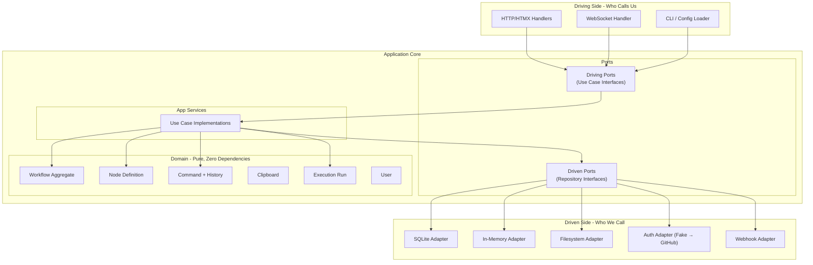
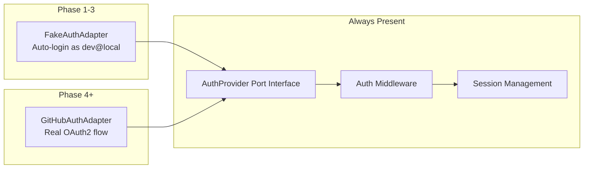
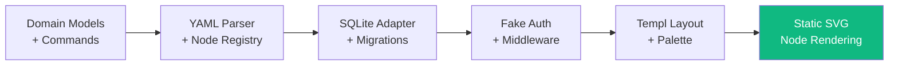
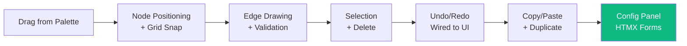
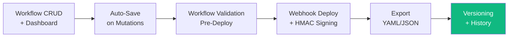
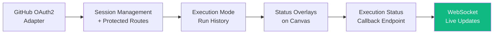
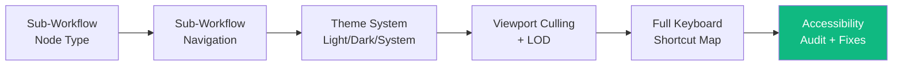
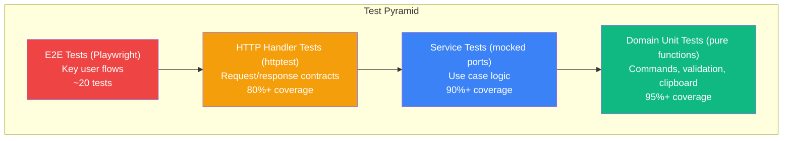

# Graphiti Implementation Plan

**Version:** 0.1.0
**Based on:** Graphiti PRD v0.1.0-draft (2026-03-09)
**Approach:** Phase-based, TDD-first, hexagonal architecture from the ground up

## How to Read This Plan

Each phase builds on the one before it, like stacking bricks. At the end of every phase you'll have something you can run, click around in, and demo. No phase leaves you with a pile of parts that don't work together yet.

Every story follows a strict TDD cycle: write the test first, watch it fail, write the minimum code to pass, then refactor. No exceptions.

## Architecture Foundation

Before diving into phases, here's the architectural contract that every line of code must respect. Think of hexagonal architecture like a medieval castle. The keep (domain) sits at the center and knows nothing about the outside world. The walls (ports) define the shape of every doorway in and out. The buildings outside the walls (adapters) can be swapped without the keep ever knowing.



**The Golden Rule:** The `internal/domain/` package imports nothing from `internal/ports/`, `internal/adapters/`, or any external library. It's pure Go with zero dependencies. If you find yourself importing `net/http` or `database/sql` inside domain, you've crossed the wall.

### Project Structure

Every file lives in a deliberate location. This structure is non-negotiable because it enforces the hexagonal boundaries at the filesystem level.

```
graphiti/
├── cmd/
│   └── server/
│       └── main.go                    # Entry point, wires adapters to ports
├── internal/
│   ├── domain/                        # Pure domain models, NO external imports
│   │   ├── workflow.go
│   │   ├── workflow_test.go
│   │   ├── node_definition.go
│   │   ├── node_definition_test.go
│   │   ├── node_instance.go
│   │   ├── edge.go
│   │   ├── command.go                 # Command interface
│   │   ├── command_test.go
│   │   ├── commands/                  # Concrete command implementations
│   │   │   ├── add_node.go
│   │   │   ├── add_node_test.go
│   │   │   ├── remove_node.go
│   │   │   ├── remove_node_test.go
│   │   │   ├── move_node.go
│   │   │   ├── move_node_test.go
│   │   │   ├── add_edge.go
│   │   │   ├── add_edge_test.go
│   │   │   ├── remove_edge.go
│   │   │   ├── remove_edge_test.go
│   │   │   ├── update_attribute.go
│   │   │   ├── update_attribute_test.go
│   │   │   ├── paste_nodes.go
│   │   │   ├── paste_nodes_test.go
│   │   │   └── rename_node.go
│   │   ├── command_history.go
│   │   ├── command_history_test.go
│   │   ├── clipboard.go
│   │   ├── clipboard_test.go
│   │   ├── execution.go
│   │   ├── user.go
│   │   └── validation.go
│   ├── ports/                         # Interface definitions only
│   │   ├── driving/
│   │   │   ├── workflow_service.go
│   │   │   ├── node_registry.go
│   │   │   └── execution_service.go
│   │   └── driven/
│   │       ├── workflow_repo.go
│   │       ├── execution_repo.go
│   │       ├── user_repo.go
│   │       ├── auth_provider.go
│   │       └── deploy_target.go
│   ├── app/                           # Application services (use case impl)
│   │   ├── workflow_service.go
│   │   ├── workflow_service_test.go
│   │   ├── node_registry.go
│   │   ├── node_registry_test.go
│   │   ├── execution_service.go
│   │   └── execution_service_test.go
│   └── adapters/
│       ├── driving/
│       │   ├── http/
│       │   │   ├── router.go
│       │   │   ├── handlers_workflow.go
│       │   │   ├── handlers_node.go
│       │   │   ├── handlers_command.go
│       │   │   ├── handlers_auth.go
│       │   │   ├── handlers_execution.go
│       │   │   ├── middleware.go
│       │   │   └── websocket.go
│       │   └── cli/
│       │       └── config_loader.go
│       └── driven/
│           ├── sqlite/
│           │   ├── workflow_repo.go
│           │   ├── workflow_repo_test.go
│           │   ├── execution_repo.go
│           │   ├── user_repo.go
│           │   └── migrations.go
│           ├── memory/
│           │   ├── workflow_repo.go    # In-memory impl for tests
│           │   └── user_repo.go
│           ├── filesystem/
│           │   └── node_loader.go
│           ├── webhook/
│           │   ├── deploy_target.go
│           │   └── deploy_target_test.go
│           └── auth/
│               ├── fake.go            # Fake auth for local dev
│               ├── fake_test.go
│               ├── github.go
│               └── github_test.go
├── web/
│   ├── templates/                     # Templ files
│   │   ├── layouts/
│   │   │   └── base.templ
│   │   ├── pages/
│   │   │   ├── dashboard.templ
│   │   │   ├── workflow_builder.templ
│   │   │   └── login.templ
│   │   ├── partials/
│   │   │   ├── node_palette.templ
│   │   │   ├── node_palette_item.templ
│   │   │   ├── config_panel.templ
│   │   │   ├── execution_list.templ
│   │   │   └── deploy_menu.templ
│   │   └── svg/
│   │       ├── canvas.templ
│   │       ├── node.templ
│   │       ├── edge.templ
│   │       └── shapes/
│   │           ├── rounded_rect.templ
│   │           ├── diamond.templ
│   │           ├── hexagon.templ
│   │           └── sub_workflow.templ
│   └── static/
│       ├── js/
│       │   ├── canvas.js
│       │   ├── drag.js
│       │   ├── connect.js
│       │   ├── select.js
│       │   ├── commands.js
│       │   ├── clipboard.js
│       │   └── theme.js
│       └── css/
│           ├── base.css
│           ├── components.css
│           ├── panels.css
│           ├── canvas.css
│           ├── nodes.css
│           └── themes/
│               ├── light.css
│               └── dark.css
├── config/
│   ├── app.yaml
│   ├── auth.yaml
│   ├── nodes/
│   │   ├── sources/
│   │   ├── processing/
│   │   ├── destinations/
│   │   └── control/
│   └── themes/
│       ├── light.yaml
│       └── dark.yaml
├── migrations/
│   └── 001_initial.sql
├── go.mod
├── Makefile
├── Dockerfile
└── README.md
```

### Authentication from Day One

Authentication is present in every phase, even the first. In early phases it's a fake adapter that auto-authenticates a hardcoded dev user. This means the auth middleware, session handling, and protected routes are all exercised from the start. When real OAuth2 lands in Phase 4, it's just swapping the adapter behind the same port interface.



## Phase 1: Foundation (The Skeleton Walks)

**Goal:** A running Go server that loads node definitions from YAML, stores workflows in SQLite, renders a three-panel layout with a categorized node palette, and displays static SVG nodes on a canvas. Fake auth protects all routes. Every domain model has tests. At demo time you can open a browser, see the palette, and see nodes rendered on a canvas.

**Estimated Duration:** 3-4 weeks



### Story 1.1: Domain Models

**What:** Define the core domain types that everything else builds on. These are pure Go structs with no external dependencies.

**Code structure:**

```go
// internal/domain/workflow.go
package domain

import "time"

type WorkflowStatus string

const (
    WorkflowStatusDraft    WorkflowStatus = "draft"
    WorkflowStatusDeployed WorkflowStatus = "deployed"
    WorkflowStatusArchived WorkflowStatus = "archived"
)

type Workflow struct {
    ID          string
    Name        string
    Description string
    Status      WorkflowStatus
    Version     int
    Nodes       []NodeInstance
    Edges       []Edge
    CreatedBy   string
    CreatedAt   time.Time
    UpdatedAt   time.Time
}

// AddNode creates a new node instance on this workflow at the given position.
func (w *Workflow) AddNode(def *NodeDefinition, x, y float64, instanceID string) *NodeInstance { ... }

// RemoveNode removes a node and all its connected edges.
func (w *Workflow) RemoveNode(nodeID string) (*NodeInstance, []Edge, error) { ... }

// AddEdge connects two ports after validating compatibility.
func (w *Workflow) AddEdge(sourceNodeID, sourcePortID, targetNodeID, targetPortID, edgeID string) error { ... }

// RemoveEdge disconnects two ports.
func (w *Workflow) RemoveEdge(edgeID string) (*Edge, error) { ... }

// FindNode returns the node with the given ID or nil.
func (w *Workflow) FindNode(nodeID string) *NodeInstance { ... }

// FindEdge returns the edge with the given ID or nil.
func (w *Workflow) FindEdge(edgeID string) *Edge { ... }

// Validate checks all invariants and returns any errors.
func (w *Workflow) Validate() []ValidationError { ... }
```

```go
// internal/domain/node_definition.go
package domain

type NodeDefinition struct {
    APIVersion  string
    Kind        string
    ID          string
    Name        string
    Description string
    Version     string
    Icon        string
    IconSvg     string
    Category    Category
    Shape       Shape
    Inputs      []PortDefinition
    Outputs     []PortDefinition
    Attributes  []AttributeDefinition
    Validation  ValidationRules
}

type Category struct {
    Group string
    Order int
}

type ShapeType string

const (
    ShapeRoundedRect ShapeType = "rounded-rect"
    ShapePill        ShapeType = "pill"
    ShapeDiamond     ShapeType = "diamond"
    ShapeHexagon     ShapeType = "hexagon"
    ShapeSubWorkflow ShapeType = "sub-workflow"
    ShapeCustom      ShapeType = "custom"
)

type Shape struct {
    Type            ShapeType
    Width           int
    MinWidth        int
    MaxWidth        int
    HeaderColor     string
    HeaderBackground string
    CustomSvg       string
}

type PortType string

const (
    PortTypeData    PortType = "data"
    PortTypeControl PortType = "control"
    PortTypeError   PortType = "error"
)

type PortPosition string

const (
    PortPositionLeftCenter   PortPosition = "left-center"
    PortPositionRightCenter  PortPosition = "right-center"
    PortPositionTopCenter    PortPosition = "top-center"
    PortPositionBottomCenter PortPosition = "bottom-center"
    PortPositionRightTop     PortPosition = "right-top"
    PortPositionRightBottom  PortPosition = "right-bottom"
)

type PortDefinition struct {
    ID             string
    Label          string
    Type           PortType
    Position       PortPosition
    MaxConnections int // -1 = unlimited
}

type AttributeType string

const (
    AttrTypeString      AttributeType = "string"
    AttrTypeText        AttributeType = "text"
    AttrTypeNumber      AttributeType = "number"
    AttrTypeBoolean     AttributeType = "boolean"
    AttrTypeEnum        AttributeType = "enum"
    AttrTypeSecret      AttributeType = "secret"
    AttrTypeJSON        AttributeType = "json"
    AttrTypeExpression  AttributeType = "expression"
    AttrTypePortMapping AttributeType = "port-mapping"
    AttrTypeWorkflowRef AttributeType = "workflow-reference"
)

type DisplayLocation string

const (
    DisplayNodeBody    DisplayLocation = "node-body"
    DisplayConfigPanel DisplayLocation = "config-panel"
    DisplayBoth        DisplayLocation = "both"
)

type AttributeDefinition struct {
    ID       string
    Label    string
    Type     AttributeType
    Default  any
    Required bool
    Display  DisplayLocation
    Group    string
    Options  []string    // for enum type
    Min      *float64    // for number type
    Max      *float64    // for number type
    Hint     string
}

type ConnectionRule struct {
    OutputPort              string
    AllowedTargetCategories []string
    AllowedTargetPorts      []string
}

type AttributeRule struct {
    Expression string
    Message    string
}

type ValidationRules struct {
    ConnectionRules []ConnectionRule
    AttributeRules  []AttributeRule
}
```

```go
// internal/domain/node_instance.go
package domain

type NodeInstance struct {
    ID              string
    DefinitionID    string
    Label           string
    X               float64
    Y               float64
    AttributeValues map[string]any
    Definition      *NodeDefinition // resolved reference
}
```

```go
// internal/domain/edge.go
package domain

type Edge struct {
    ID           string
    SourceNodeID string
    SourcePortID string
    TargetNodeID string
    TargetPortID string
}
```

```go
// internal/domain/user.go
package domain

import "time"

type User struct {
    ID             string
    Username       string
    Email          string
    AvatarURL      string
    AuthProvider   string
    AuthProviderID string
    CreatedAt      time.Time
    LastLoginAt    time.Time
}
```

```go
// internal/domain/execution.go
package domain

import "time"

type ExecutionStatus string

const (
    ExecStatusPending   ExecutionStatus = "pending"
    ExecStatusRunning   ExecutionStatus = "running"
    ExecStatusCompleted ExecutionStatus = "completed"
    ExecStatusFailed    ExecutionStatus = "failed"
    ExecStatusCancelled ExecutionStatus = "cancelled"
)

type NodeExecStatus string

const (
    NodeExecPending   NodeExecStatus = "pending"
    NodeExecRunning   NodeExecStatus = "running"
    NodeExecCompleted NodeExecStatus = "completed"
    NodeExecFailed    NodeExecStatus = "failed"
    NodeExecSkipped   NodeExecStatus = "skipped"
)

type ExecutionRun struct {
    ID              string
    WorkflowID      string
    WorkflowVersion int
    Status          ExecutionStatus
    StartedAt       time.Time
    CompletedAt     time.Time
    TriggerType     string
    TriggerData     map[string]any
    NodeStatuses    map[string]*NodeExecutionStatus
}

type NodeExecutionStatus struct {
    NodeID       string
    Status       NodeExecStatus
    StartedAt    time.Time
    CompletedAt  time.Time
    InputData    map[string]any
    OutputData   map[string]any
    ErrorMessage string
    Logs         []LogEntry
}

type LogEntry struct {
    Timestamp time.Time
    Level     string
    Message   string
}
```

```go
// internal/domain/validation.go
package domain

type ValidationError struct {
    NodeID  string // empty for workflow-level errors
    Field   string
    Message string
}
```

**Acceptance Criteria:**

- [ ] All domain types compile with zero external imports (only stdlib `time`, `encoding/json`, `errors`)
- [ ] `Workflow.AddNode` creates a `NodeInstance` with a UUID, default attribute values from the definition, and adds it to the workflow's node list
- [ ] `Workflow.RemoveNode` removes the node AND all edges connected to it, returning the removed node and edges for undo
- [ ] `Workflow.AddEdge` rejects edges where port types don't match (data-to-data only, etc.)
- [ ] `Workflow.AddEdge` rejects edges that would exceed a port's `maxConnections`
- [ ] `Workflow.Validate` detects cycles using topological sort and returns a `ValidationError`
- [ ] `Workflow.Validate` flags nodes with missing required attributes
- [ ] `Workflow.Validate` enforces connection rules from node definitions (allowed target categories)
- [ ] Unit tests cover all of the above, including edge cases (empty workflow, self-referencing edge, duplicate node IDs)
- [ ] Tests are written FIRST, following TDD red-green-refactor cycle
- [ ] Test coverage for the `domain` package is 95%+

### Story 1.2: Command Interface and All Command Implementations

**What:** Implement the Command Pattern infrastructure and every concrete command type. This is the backbone that enables undo/redo and prepares for collaborative editing. Think of each command as a recorded chess move: it knows how to play itself forward and how to rewind.

**Code structure:**

```go
// internal/domain/command.go
package domain

type Command interface {
    // Execute applies the mutation and returns the inverse command for undo.
    Execute(wf *Workflow) (Command, error)

    // Type returns a string identifier for serialization.
    Type() string

    // Serialize converts the command to JSON.
    Serialize() ([]byte, error)
}

// DeserializeCommand reconstructs a Command from its type string and JSON bytes.
func DeserializeCommand(cmdType string, data []byte) (Command, error) { ... }
```

```go
// internal/domain/commands/add_node.go
package commands

import "graphiti/internal/domain"

type AddNodeCommand struct {
    DefinitionID string  `json:"definitionId"`
    InstanceID   string  `json:"instanceId"`
    Label        string  `json:"label"`
    X            float64 `json:"x"`
    Y            float64 `json:"y"`
}

func (c *AddNodeCommand) Execute(wf *domain.Workflow) (domain.Command, error) {
    node := wf.AddNode(/* resolved def */, c.X, c.Y, c.InstanceID)
    if node == nil {
        return nil, errors.New("failed to add node")
    }
    // Return inverse: a RemoveNodeCommand that captures the full node state
    return &RemoveNodeCommand{
        NodeID:         node.ID,
        SerializedNode: node, // full snapshot for restore
    }, nil
}

func (c *AddNodeCommand) Type() string { return "add_node" }
func (c *AddNodeCommand) Serialize() ([]byte, error) { return json.Marshal(c) }
```

```go
// internal/domain/commands/move_node.go
package commands

type MoveNodeCommand struct {
    NodeID string  `json:"nodeId"`
    FromX  float64 `json:"fromX"`
    FromY  float64 `json:"fromY"`
    ToX    float64 `json:"toX"`
    ToY    float64 `json:"toY"`
}

func (c *MoveNodeCommand) Execute(wf *domain.Workflow) (domain.Command, error) {
    node := wf.FindNode(c.NodeID)
    if node == nil {
        return nil, ErrNodeNotFound
    }
    node.X = c.ToX
    node.Y = c.ToY
    // Inverse: move back to original position
    return &MoveNodeCommand{
        NodeID: c.NodeID,
        FromX:  c.ToX, FromY: c.ToY,
        ToX:    c.FromX, ToY: c.FromY,
    }, nil
}
```

**All command types to implement:**

| Command | Key Fields | Inverse |
|---|---|---|
| `AddNodeCommand` | definitionID, instanceID, x, y | `RemoveNodeCommand` with full node state |
| `RemoveNodeCommand` | nodeID, serializedNode, removedEdges | `AddNodeCommand` with full state restore |
| `MoveNodeCommand` | nodeID, fromX, fromY, toX, toY | `MoveNodeCommand` with positions swapped |
| `MoveNodesCommand` | []nodeID, []fromPos, []toPos | `MoveNodesCommand` with positions swapped |
| `AddEdgeCommand` | edgeID, sourceNodeID, sourcePortID, targetNodeID, targetPortID | `RemoveEdgeCommand` |
| `RemoveEdgeCommand` | edgeID, serializedEdge | `AddEdgeCommand` with full edge state |
| `UpdateAttributeCommand` | nodeID, attrID, oldValue, newValue | `UpdateAttributeCommand` with values swapped |
| `PasteNodesCommand` | []serializedNodes, []serializedEdges, idMapping | `RemoveNodesCommand` (batch) |
| `RenameNodeCommand` | nodeID, oldLabel, newLabel | `RenameNodeCommand` with labels swapped |

**Acceptance Criteria:**

- [ ] `Command` interface exists in `domain/command.go` with `Execute`, `Type`, and `Serialize` methods
- [ ] All 9 command types listed above are implemented with their inverse logic
- [ ] Every command is JSON-serializable and deserializable (round-trip test)
- [ ] `AddNodeCommand.Execute` returns a `RemoveNodeCommand` that captures the complete node state
- [ ] `RemoveNodeCommand.Execute` restores the node and all its connected edges
- [ ] `MoveNodeCommand.Execute` returns a `MoveNodeCommand` with from/to swapped
- [ ] `MoveNodesCommand` handles batch moves as a single operation
- [ ] `AddEdgeCommand.Execute` validates port compatibility before creating the edge
- [ ] `UpdateAttributeCommand` stores both old and new values for clean reversal
- [ ] `PasteNodesCommand` generates new UUIDs and remaps internal edges
- [ ] `DeserializeCommand` can reconstruct any command from its type string and JSON
- [ ] Each command type has its own `_test.go` file with table-driven tests
- [ ] Tests verify the full round-trip: execute → check state → undo (execute inverse) → check state restored → redo → check state applied again

### Story 1.3: Command History (Undo/Redo Stack)

**What:** The `CommandHistory` struct manages the undo and redo stacks. Every mutation flows through it. It's the single choke point that makes the whole system auditable and reversible.

**Code structure:**

```go
// internal/domain/command_history.go
package domain

import "errors"

var (
    ErrNothingToUndo = errors.New("nothing to undo")
    ErrNothingToRedo = errors.New("nothing to redo")
)

type CommandHistory struct {
    undoStack []Command
    redoStack []Command
    maxSize   int
}

func NewCommandHistory(maxSize int) *CommandHistory {
    return &CommandHistory{
        undoStack: make([]Command, 0),
        redoStack: make([]Command, 0),
        maxSize:   maxSize,
    }
}

func (h *CommandHistory) Execute(wf *Workflow, cmd Command) error {
    inverse, err := cmd.Execute(wf)
    if err != nil {
        return err
    }
    h.undoStack = append(h.undoStack, inverse)
    h.redoStack = nil // new action clears redo
    if len(h.undoStack) > h.maxSize {
        h.undoStack = h.undoStack[1:]
    }
    return nil
}

func (h *CommandHistory) Undo(wf *Workflow) error {
    if len(h.undoStack) == 0 {
        return ErrNothingToUndo
    }
    cmd := h.undoStack[len(h.undoStack)-1]
    h.undoStack = h.undoStack[:len(h.undoStack)-1]
    inverse, err := cmd.Execute(wf)
    if err != nil {
        return err
    }
    h.redoStack = append(h.redoStack, inverse)
    return nil
}

func (h *CommandHistory) Redo(wf *Workflow) error {
    if len(h.redoStack) == 0 {
        return ErrNothingToRedo
    }
    cmd := h.redoStack[len(h.redoStack)-1]
    h.redoStack = h.redoStack[:len(h.redoStack)-1]
    inverse, err := cmd.Execute(wf)
    if err != nil {
        return err
    }
    h.undoStack = append(h.undoStack, inverse)
    return nil
}

func (h *CommandHistory) CanUndo() bool { return len(h.undoStack) > 0 }
func (h *CommandHistory) CanRedo() bool { return len(h.redoStack) > 0 }
```

**Acceptance Criteria:**

- [ ] `CommandHistory.Execute` pushes the inverse command onto the undo stack
- [ ] `CommandHistory.Execute` clears the redo stack
- [ ] `CommandHistory.Undo` pops from the undo stack, executes the inverse, and pushes the result onto redo
- [ ] `CommandHistory.Redo` pops from the redo stack, executes it, and pushes the inverse onto undo
- [ ] Undo on an empty stack returns `ErrNothingToUndo`
- [ ] Redo on an empty stack returns `ErrNothingToRedo`
- [ ] Stack respects `maxSize`, dropping the oldest entries when full
- [ ] Integration test: add 3 nodes → undo all 3 → redo 2 → add new node → redo stack is cleared
- [ ] Integration test: move node A→B → undo → verify position is A → redo → verify position is B

### Story 1.4: Port Interfaces (Driving and Driven)

**What:** Define every port interface. These are the contracts that adapters must fulfill. No implementation yet, just the shapes of the doorways.

```go
// internal/ports/driving/workflow_service.go
package driving

import (
    "context"
    "graphiti/internal/domain"
)

type WorkflowService interface {
    CreateWorkflow(ctx context.Context, name, description, userID string) (*domain.Workflow, error)
    GetWorkflow(ctx context.Context, id string) (*domain.Workflow, error)
    ListWorkflows(ctx context.Context, userID string) ([]*domain.WorkflowSummary, error)
    SaveWorkflow(ctx context.Context, wf *domain.Workflow) error
    DeleteWorkflow(ctx context.Context, id string) error

    // Command execution
    ExecuteCommand(ctx context.Context, workflowID string, cmd domain.Command) (*CommandResult, error)
    Undo(ctx context.Context, workflowID string) (*CommandResult, error)
    Redo(ctx context.Context, workflowID string) (*CommandResult, error)

    // Clipboard
    CopyNodes(ctx context.Context, workflowID string, nodeIDs []string) (*domain.ClipboardPayload, error)
    PasteNodes(ctx context.Context, workflowID string, payload *domain.ClipboardPayload, x, y float64) (*CommandResult, error)

    // Deploy
    DeployWorkflow(ctx context.Context, workflowID, target, userID string) (*domain.DeployResult, error)

    // Export
    ExportWorkflow(ctx context.Context, workflowID, format string) ([]byte, error)
}

type CommandResult struct {
    AffectedNodeIDs []string
    AffectedEdgeIDs []string
    CanUndo         bool
    CanRedo         bool
}

// WorkflowSummary is a lightweight projection for listing.
type WorkflowSummary struct {
    ID        string
    Name      string
    Status    domain.WorkflowStatus
    Version   int
    UpdatedAt time.Time
}
```

```go
// internal/ports/driving/node_registry.go
package driving

type NodeRegistryService interface {
    GetAllDefinitions(ctx context.Context) ([]*domain.NodeDefinition, error)
    GetByCategory(ctx context.Context, category string) ([]*domain.NodeDefinition, error)
    GetByID(ctx context.Context, id string) (*domain.NodeDefinition, error)
    Search(ctx context.Context, query string) ([]*domain.NodeDefinition, error)
}
```

```go
// internal/ports/driven/workflow_repo.go
package driven

type WorkflowRepository interface {
    Create(ctx context.Context, wf *domain.Workflow) error
    GetByID(ctx context.Context, id string) (*domain.Workflow, error)
    List(ctx context.Context, filter WorkflowFilter) ([]*WorkflowSummary, error)
    Update(ctx context.Context, wf *domain.Workflow) error
    Delete(ctx context.Context, id string) error
    GetVersionHistory(ctx context.Context, id string) ([]*domain.WorkflowVersion, error)
}
```

```go
// internal/ports/driven/auth_provider.go
package driven

type AuthProvider interface {
    GetAuthURL(state string) string
    ExchangeCode(ctx context.Context, code string) (*TokenPair, error)
    GetUserInfo(ctx context.Context, accessToken string) (*domain.UserInfo, error)
    RefreshToken(ctx context.Context, refreshToken string) (*TokenPair, error)
}

type TokenPair struct {
    AccessToken  string
    RefreshToken string
    ExpiresAt    time.Time
}
```

```go
// internal/ports/driven/deploy_target.go
package driven

type DeployTarget interface {
    Deploy(ctx context.Context, payload domain.DeployPayload) (*domain.DeployResult, error)
}
```

```go
// internal/ports/driven/user_repo.go
package driven

type UserRepository interface {
    Upsert(ctx context.Context, user *domain.User) error
    GetByID(ctx context.Context, id string) (*domain.User, error)
    GetByProviderID(ctx context.Context, provider, providerID string) (*domain.User, error)
}
```

```go
// internal/ports/driven/execution_repo.go
package driven

type ExecutionRepository interface {
    Create(ctx context.Context, run *domain.ExecutionRun) error
    GetByID(ctx context.Context, id string) (*domain.ExecutionRun, error)
    ListByWorkflow(ctx context.Context, workflowID string, filter ExecutionFilter) ([]*domain.ExecutionRunSummary, error)
    UpdateNodeStatus(ctx context.Context, runID, nodeID string, status domain.NodeExecutionStatus) error
    AppendNodeLog(ctx context.Context, runID, nodeID string, entry domain.LogEntry) error
}
```

```go
// internal/ports/driven/node_definition_repo.go
package driven

type NodeDefinitionRepository interface {
    LoadAll(ctx context.Context) ([]*domain.NodeDefinition, error)
    GetByID(ctx context.Context, id string) (*domain.NodeDefinition, error)
    GetByCategory(ctx context.Context, category string) ([]*domain.NodeDefinition, error)
    Search(ctx context.Context, query string) ([]*domain.NodeDefinition, error)
}
```

**Acceptance Criteria:**

- [ ] All port interfaces compile and are documented with GoDoc comments
- [ ] Port packages import only from `domain` (never from `adapters` or `app`)
- [ ] Driving ports define what the outside world can ask us to do (use cases)
- [ ] Driven ports define what we need the outside world to provide (storage, auth, deploy)
- [ ] Each port interface has a corresponding mock generated (using testify/mock or manual fakes) for testing

### Story 1.5: YAML Node Definition Parser and In-Memory Registry

**What:** Read YAML files from disk, validate them, and build an in-memory node registry that the palette and canvas use.

```go
// internal/adapters/driven/filesystem/node_loader.go
package filesystem

type YAMLNodeLoader struct {
    basePath string
}

func NewYAMLNodeLoader(basePath string) *YAMLNodeLoader { ... }

// LoadAll walks the directory tree, parses every .yaml file,
// validates it, and returns the valid definitions.
// Invalid files are logged and skipped.
func (l *YAMLNodeLoader) LoadAll(ctx context.Context) ([]*domain.NodeDefinition, error) { ... }
```

**Sample YAML for testing:**

```yaml
# config/nodes/sources/twilio.yaml
apiVersion: graphiti/v1
kind: NodeDefinition
metadata:
  id: source-twilio
  name: Twilio
  description: "Receives call recording callbacks from Twilio"
  version: "1.0.0"
  icon: "T"
category:
  group: Sources
  order: 20
shape:
  type: rounded-rect
  width: 200
  minWidth: 160
  maxWidth: 320
  headerColor: "var(--cyan)"
  headerBackground: "var(--cyan-dim)"
ports:
  inputs: []
  outputs:
    - id: out-main
      label: "Output"
      type: data
      position: right-center
      maxConnections: -1
attributes:
  - id: endpoint
    label: "Endpoint"
    type: string
    default: "/ingest/twilio"
    required: true
    display: node-body
    group: "Connection"
  - id: format
    label: "Audio Format"
    type: enum
    options: ["wav", "mp3", "ogg", "flac"]
    default: "wav"
    display: node-body
    group: "Connection"
validation:
  connectionRules:
    - outputPort: out-main
      allowedTargetCategories: ["Processing", "Destinations"]
      allowedTargetPorts: ["data"]
```

**Acceptance Criteria:**

- [ ] Parser reads `.yaml` files recursively from the configured directory
- [ ] Parser validates `apiVersion` is `graphiti/v1` and `kind` is `NodeDefinition`
- [ ] Parser validates required fields: `metadata.id`, `metadata.name`, `category.group`, `shape.type`
- [ ] Parser validates `shape.type` against the allowed set (rounded-rect, pill, diamond, hexagon, sub-workflow, custom)
- [ ] Parser validates port types against the allowed set (data, control, error)
- [ ] Parser validates attribute types against the allowed set
- [ ] Invalid files are logged as warnings but don't prevent startup
- [ ] Duplicate `metadata.id` values across files are rejected with a clear error
- [ ] The in-memory registry supports `GetByID`, `GetByCategory`, `Search`, and `LoadAll`
- [ ] `Search` matches against name, description, and category (case-insensitive)
- [ ] At least 4 sample YAML definitions ship with the project (one per category: source, processing, destination, control flow)
- [ ] Tests use temporary directories with test YAML files, not real config files

### Story 1.6: Fake Auth Adapter, Middleware, and Session Management

**What:** Build the auth port interface, a fake adapter for local dev, session middleware, and route protection. The fake adapter auto-authenticates a dev user so every request passes through the same auth pipeline that production will use.

```go
// internal/adapters/driven/auth/fake.go
package auth

type FakeAuthAdapter struct {
    devUser *domain.User
}

func NewFakeAuth() *FakeAuthAdapter {
    return &FakeAuthAdapter{
        devUser: &domain.User{
            ID:             "dev-user-001",
            Username:       "dev",
            Email:          "dev@local",
            AuthProvider:   "fake",
            AuthProviderID: "fake-001",
        },
    }
}

func (f *FakeAuthAdapter) GetAuthURL(state string) string {
    return "/auth/callback?code=fake-code&state=" + state
}

func (f *FakeAuthAdapter) ExchangeCode(ctx context.Context, code string) (*driven.TokenPair, error) {
    return &driven.TokenPair{
        AccessToken: "fake-token",
        ExpiresAt:   time.Now().Add(24 * time.Hour),
    }, nil
}

func (f *FakeAuthAdapter) GetUserInfo(ctx context.Context, token string) (*domain.UserInfo, error) {
    return &domain.UserInfo{
        ID:       f.devUser.AuthProviderID,
        Username: f.devUser.Username,
        Email:    f.devUser.Email,
        Provider: "fake",
    }, nil
}
```

```go
// internal/adapters/driving/http/middleware.go
package http

func AuthMiddleware(sessionStore SessionStore) func(http.Handler) http.Handler {
    return func(next http.Handler) http.Handler {
        return http.HandlerFunc(func(w http.ResponseWriter, r *http.Request) {
            session, err := sessionStore.Get(r)
            if err != nil || session.UserID == "" {
                http.Redirect(w, r, "/auth/login", http.StatusFound)
                return
            }
            ctx := context.WithValue(r.Context(), userContextKey, session)
            next.ServeHTTP(w, r.WithContext(ctx))
        })
    }
}
```

**Acceptance Criteria:**

- [ ] `FakeAuthAdapter` implements the `AuthProvider` port interface
- [ ] The auth middleware reads session cookies and redirects unauthenticated users to `/auth/login`
- [ ] In dev mode, navigating to `/auth/login` auto-completes the fake flow and sets a session cookie
- [ ] All API routes (except `/auth/*`) require authentication
- [ ] The session contains user ID, username, and expiry
- [ ] Session expiry is configurable (default 24 hours)
- [ ] A `POST /auth/logout` endpoint clears the session cookie
- [ ] The auth adapter to use (fake vs. github) is selected by config: `auth.provider: fake`
- [ ] Tests verify that unauthenticated requests to protected routes get redirected
- [ ] Tests verify that authenticated requests pass through middleware successfully

### Story 1.7: SQLite Adapter with Migrations

**What:** Implement the SQLite storage adapter for workflows, users, and execution runs. Migrations run automatically on startup.

**Schema (migrations/001_initial.sql):**

```sql
CREATE TABLE IF NOT EXISTS users (
    id TEXT PRIMARY KEY,
    username TEXT NOT NULL,
    email TEXT,
    avatar_url TEXT,
    auth_provider TEXT NOT NULL,
    auth_provider_id TEXT NOT NULL,
    created_at DATETIME DEFAULT CURRENT_TIMESTAMP,
    last_login_at DATETIME,
    UNIQUE(auth_provider, auth_provider_id)
);

CREATE TABLE IF NOT EXISTS workflows (
    id TEXT PRIMARY KEY,
    name TEXT NOT NULL,
    description TEXT,
    definition JSON NOT NULL,
    status TEXT DEFAULT 'draft',
    version INTEGER DEFAULT 1,
    created_by TEXT REFERENCES users(id),
    created_at DATETIME DEFAULT CURRENT_TIMESTAMP,
    updated_at DATETIME DEFAULT CURRENT_TIMESTAMP
);

CREATE TABLE IF NOT EXISTS workflow_versions (
    id TEXT PRIMARY KEY,
    workflow_id TEXT REFERENCES workflows(id) ON DELETE CASCADE,
    version INTEGER NOT NULL,
    definition JSON NOT NULL,
    deployed_at DATETIME,
    deployed_by TEXT REFERENCES users(id),
    created_at DATETIME DEFAULT CURRENT_TIMESTAMP
);

CREATE TABLE IF NOT EXISTS execution_runs (
    id TEXT PRIMARY KEY,
    workflow_id TEXT REFERENCES workflows(id),
    workflow_version INTEGER NOT NULL,
    status TEXT DEFAULT 'pending',
    started_at DATETIME,
    completed_at DATETIME,
    trigger_type TEXT,
    trigger_data JSON
);

CREATE TABLE IF NOT EXISTS execution_node_statuses (
    id TEXT PRIMARY KEY,
    run_id TEXT REFERENCES execution_runs(id) ON DELETE CASCADE,
    node_id TEXT NOT NULL,
    status TEXT DEFAULT 'pending',
    started_at DATETIME,
    completed_at DATETIME,
    input_data JSON,
    output_data JSON,
    error_message TEXT,
    logs JSON
);
```

**Acceptance Criteria:**

- [ ] SQLite adapter implements `WorkflowRepository`, `UserRepository`, and `ExecutionRepository`
- [ ] Database file path is configurable (default `./data/graphiti.db`)
- [ ] WAL mode is enabled for concurrent read/write
- [ ] Migrations run automatically on first startup
- [ ] `WorkflowRepository.Create` stores the full workflow definition as JSON
- [ ] `WorkflowRepository.GetByID` deserializes the JSON back into domain objects with all nodes, edges, and attributes
- [ ] `WorkflowRepository.List` returns lightweight summaries (no full definition)
- [ ] `UserRepository.Upsert` creates or updates a user record
- [ ] All adapter tests use `:memory:` SQLite databases so they're fast and isolated
- [ ] Tests verify round-trip: create → get → verify fields match
- [ ] Tests verify cascading deletes (deleting a workflow removes its versions)

### Story 1.8: Templ Layout, Node Palette, and Static SVG Canvas

**What:** Build the three-panel layout in Templ, render the node palette from the in-memory registry, and render static SVG nodes on the canvas for a saved workflow.

**Acceptance Criteria:**

- [ ] The base layout renders a top navigation bar, left panel (260px), center canvas (flexible), and right panel (300px)
- [ ] Top nav shows: logo, breadcrumb (`/ Workflows / {name}`), placeholder Deploy button
- [ ] Left panel in builder mode shows "Components" header, search input, and categorized node list
- [ ] Node palette items show: colored icon badge, node name, short description
- [ ] Categories are collapsible, sorted by the `order` field
- [ ] Search input is wired with `hx-get="/api/nodes/search"` and `hx-trigger="keyup changed delay:200ms"`
- [ ] Center panel contains an SVG element with a dot-grid pattern (24px spacing)
- [ ] When a workflow is loaded, its nodes render as SVG groups with correct shapes per category
- [ ] Source nodes have a left accent bar, processors are plain rounded rects, destinations have a right accent bar, diamonds for conditions, hexagons for merge/split, double-border for sub-workflows
- [ ] Each SVG node shows: icon badge, title text, status badge, attribute rows for `display: node-body` attributes
- [ ] Ports render as circles at their defined positions
- [ ] Edges render as SVG `<path>` elements with Bezier curves and arrowheads
- [ ] The right panel shows a placeholder message ("Select a node to configure")
- [ ] All pages are served behind the auth middleware
- [ ] The page loads in under 200ms with 20 nodes

### Story 1.9: Application Service Wiring and Main Entry Point

**What:** Wire everything together in `cmd/server/main.go`. Load config, initialize adapters, plug them into ports, start the HTTP server.

```go
// cmd/server/main.go (simplified)
func main() {
    cfg := config.Load("config/app.yaml")

    // Driven adapters
    db := sqlite.NewDB(cfg.Storage.SQLite.Path)
    workflowRepo := sqlite.NewWorkflowRepo(db)
    userRepo := sqlite.NewUserRepo(db)
    nodeLoader := filesystem.NewYAMLNodeLoader(cfg.NodeDefinitions.Path)
    var authAdapter driven.AuthProvider
    if cfg.Auth.Provider == "fake" {
        authAdapter = auth.NewFakeAuth()
    } else {
        authAdapter = auth.NewGitHub(cfg.Auth.GitHub)
    }

    // App services
    nodeRegistry := app.NewNodeRegistry(nodeLoader)
    workflowSvc := app.NewWorkflowService(workflowRepo, nodeRegistry)

    // Driving adapters
    router := httpAdapter.NewRouter(workflowSvc, nodeRegistry, authAdapter, userRepo)
    server := &http.Server{Addr: cfg.Server.Addr(), Handler: router}
    server.ListenAndServe()
}
```

**Acceptance Criteria:**

- [ ] `go run cmd/server/main.go` starts the server with zero manual setup beyond having Go installed
- [ ] Config is loaded from `config/app.yaml` with env var interpolation for secrets
- [ ] The YAML node loader runs at startup and populates the registry
- [ ] SQLite migrations run automatically
- [ ] Fake auth is active when `auth.provider: fake`
- [ ] Navigating to `http://localhost:8080` auto-authenticates (fake mode) and shows the dashboard
- [ ] The dashboard lists existing workflows (or an empty state)
- [ ] Clicking "New Workflow" creates one and opens the builder view
- [ ] The builder view shows the three-panel layout with palette and an empty canvas
- [ ] A `Makefile` exists with targets: `build`, `run`, `test`, `lint`

**Phase 1 Demo Checkpoint:** Open a browser to `localhost:8080`. You're automatically logged in. You see a dashboard. You create a new workflow. The builder opens with a palette of nodes on the left, an empty SVG canvas with a dot grid in the center, and a placeholder config panel on the right. Nodes in the palette are grouped by category with icons. If you load a pre-seeded workflow, you see nodes rendered with their correct shapes and edges drawn between them. Nothing is interactive yet, but the skeleton walks.

## Phase 2: Interactive Canvas

**Goal:** The canvas comes alive. You can drag nodes from the palette, move them around, draw connections between ports, select things, delete them, undo/redo everything, and copy/paste groups of nodes. The config panel loads when you select a node and saves changes. At demo time, you can build a complete workflow by hand.

**Estimated Duration:** 4-5 weeks



### Story 2.1: Vanilla JS Canvas Engine (Pan, Zoom, Viewport)

**What:** Write the core `canvas.js` module that manages the SVG viewport. Pan, zoom, and all the coordinate math that every other interaction depends on.

**Code structure:**

```javascript
// web/static/js/canvas.js

export class CanvasEngine {
    constructor(svgElement) {
        this.svg = svgElement;
        this.contentGroup = svgElement.querySelector('.canvas-content');
        this.scale = 1.0;
        this.panX = 0;
        this.panY = 0;
        this.minScale = 0.25;
        this.maxScale = 2.0;
        this.gridSize = 24;
        this._bindEvents();
    }

    // Convert screen coordinates to canvas coordinates
    screenToCanvas(screenX, screenY) { ... }

    // Convert canvas coordinates to screen coordinates
    canvasToScreen(canvasX, canvasY) { ... }

    // Snap a position to the nearest grid point
    snapToGrid(x, y) {
        return {
            x: Math.round(x / this.gridSize) * this.gridSize,
            y: Math.round(y / this.gridSize) * this.gridSize,
        };
    }

    zoom(delta, centerX, centerY) { ... }
    pan(dx, dy) { ... }
    fitToView() { ... }

    _applyTransform() {
        this.contentGroup.setAttribute('transform',
            `translate(${this.panX}, ${this.panY}) scale(${this.scale})`);
    }
}
```

**Acceptance Criteria:**

- [ ] Mouse wheel zooms in/out centered on cursor position
- [ ] Zoom range is clamped between 25% and 200%
- [ ] Middle-click drag pans the canvas
- [ ] Space+left-click drag also pans
- [ ] Trackpad pinch-to-zoom is supported
- [ ] Pan and zoom are smooth (transforms applied via `requestAnimationFrame`)
- [ ] The dot grid scales and translates with the content
- [ ] The current zoom percentage is displayed in the bottom-right HUD
- [ ] Zoom control buttons work: + (zoom in), - (zoom out), fit-to-view
- [ ] Fit-to-view calculates the bounding box of all nodes and adjusts to show everything with 48px padding
- [ ] `screenToCanvas` and `canvasToScreen` conversions are accurate at all zoom levels
- [ ] `snapToGrid` rounds to the nearest 24px boundary

### Story 2.2: Drag from Palette to Canvas

**What:** Write `drag.js` to handle dragging a node type from the palette and dropping it onto the canvas. The drop dispatches an `AddNodeCommand` to the server.

**Code structure:**

```javascript
// web/static/js/drag.js

export class DragManager {
    constructor(canvas, commandDispatcher) {
        this.canvas = canvas;
        this.dispatcher = commandDispatcher;
        this.ghost = null;
        this._bindPaletteItems();
    }

    _onPaletteMouseDown(e, definitionId) {
        // Create ghost element, start tracking
    }

    _onMouseMove(e) {
        // Move ghost to cursor position
    }

    _onMouseUp(e) {
        if (!this._isOverCanvas(e)) { this._cancel(); return; }
        const pos = this.canvas.screenToCanvas(e.clientX, e.clientY);
        const snapped = this.canvas.snapToGrid(pos.x, pos.y);
        this.dispatcher.dispatch('add_node', {
            definitionId: this.draggedDefinitionId,
            x: snapped.x,
            y: snapped.y,
        });
    }
}
```

```javascript
// web/static/js/commands.js

export class CommandDispatcher {
    constructor(workflowId) {
        this.workflowId = workflowId;
    }

    async dispatch(type, payload) {
        const resp = await fetch(`/api/workflows/${this.workflowId}/commands`, {
            method: 'POST',
            headers: { 'Content-Type': 'application/json' },
            body: JSON.stringify({ type, ...payload }),
        });
        const result = await resp.json();
        this._applySvgUpdates(result.svgFragments);
        this._updateUndoRedoState(result.canUndo, result.canRedo);
        return result;
    }

    async undo() {
        const resp = await fetch(`/api/workflows/${this.workflowId}/undo`, { method: 'POST' });
        // apply updates...
    }

    async redo() {
        const resp = await fetch(`/api/workflows/${this.workflowId}/redo`, { method: 'POST' });
        // apply updates...
    }
}
```

**Acceptance Criteria:**

- [ ] Palette items have `cursor: grab` and switch to `cursor: grabbing` on mousedown
- [ ] Dragging creates a semi-transparent ghost node that follows the cursor
- [ ] The ghost shows the node's shape and name at the correct size
- [ ] Dropping on the canvas sends `POST /api/workflows/{id}/commands` with `type: "add_node"`
- [ ] The server creates the node via `AddNodeCommand`, which goes through `CommandHistory.Execute`
- [ ] The response includes the new node's SVG fragment, which is injected into the canvas DOM
- [ ] The node appears at the drop position, snapped to the nearest grid point
- [ ] Dropping outside the canvas cancels the drag (no server call, ghost disappears)
- [ ] The new node gets a UUID and default attribute values from the definition
- [ ] The operation is on the undo stack (Ctrl+Z removes the just-added node)

### Story 2.3: Move Nodes on Canvas

**What:** Let users reposition nodes by clicking and dragging them.

**Acceptance Criteria:**

- [ ] Clicking and dragging a node moves it smoothly (updating SVG `transform` on each frame)
- [ ] Position updates use `requestAnimationFrame` to maintain 60fps
- [ ] Connected edges update their Bezier paths in real-time during the drag
- [ ] On mouse release, the final position snaps to the grid
- [ ] A `MoveNodeCommand` is dispatched with `fromX/fromY/toX/toY`
- [ ] Moving multiple selected nodes dispatches a single `MoveNodesCommand`
- [ ] The move is undoable (undo snaps back to the original position)
- [ ] Dragging a node that isn't selected first selects it then starts the drag

### Story 2.4: Edge Drawing Between Ports

**What:** Write `connect.js` to handle drawing connections. The user clicks an output port, drags to an input port, and an edge is created if the connection is valid.

**Acceptance Criteria:**

- [ ] Hovering over a port highlights it (scale-up, border color change)
- [ ] Clicking and dragging from an output port draws a temporary Bezier curve from the port to the cursor
- [ ] Valid target input ports highlight in green as the cursor approaches within 20px
- [ ] Invalid ports (wrong type, at max connections) appear dimmed with a red tint
- [ ] Releasing on a valid input port dispatches `AddEdgeCommand`
- [ ] The server validates port compatibility (type matching, max connections, connection rules, no cycles)
- [ ] On success, the new edge SVG `<path>` is added to the edge layer with an arrowhead marker
- [ ] Releasing on empty space or an invalid port cancels the operation (no server call)
- [ ] A tooltip briefly explains why a port is invalid when hovering during a drag
- [ ] The edge creation is undoable

### Story 2.5: Connection Validation

**What:** Server-side validation that prevents invalid edges from being created.

```go
// internal/domain/workflow.go (AddEdge method)
func (w *Workflow) AddEdge(sourceNodeID, sourcePortID, targetNodeID, targetPortID, edgeID string) error {
    // 1. Both nodes must exist
    // 2. Both ports must exist on their respective nodes
    // 3. Port types must match (data→data, control→control, error→error)
    // 4. Target port must not exceed maxConnections
    // 5. Connection rules from source node definition must allow the target category
    // 6. Adding this edge must not create a cycle (topological sort check)
}
```

**Acceptance Criteria:**

- [ ] Edges are only allowed between matching port types
- [ ] An input port at max connections (default 1 for inputs) rejects new connections
- [ ] The node definition's `connectionRules.allowedTargetCategories` is enforced
- [ ] The node definition's `connectionRules.allowedTargetPorts` is enforced
- [ ] A cycle detection algorithm (Kahn's or DFS-based) prevents edges that would create loops
- [ ] All validation errors return specific, user-friendly messages
- [ ] Each validation rule has dedicated unit tests with both passing and failing cases

### Story 2.6: Selection and Deletion

**What:** Write `select.js` to manage single-select, multi-select, and keyboard-driven deletion.

**Acceptance Criteria:**

- [ ] Clicking a node selects it (accent-colored border highlight) and deselects everything else
- [ ] Clicking the canvas background deselects all
- [ ] Ctrl/Cmd+click toggles a node in/out of the selection
- [ ] Click-dragging on empty canvas space draws a selection rectangle
- [ ] All nodes within the rectangle on release are selected
- [ ] Clicking an edge selects it (thicker stroke, accent color)
- [ ] Pressing Delete/Backspace removes selected nodes and their connected edges via `RemoveNodeCommand`
- [ ] A confirmation dialog appears before deleting nodes (skippable with Shift+Delete)
- [ ] Deleting multiple selected nodes is a single undoable command
- [ ] Selected node triggers an HTMX load of the config panel in the right panel

### Story 2.7: Undo/Redo Keyboard Shortcuts

**What:** Wire Ctrl+Z and Ctrl+Shift+Z to the undo/redo endpoints.

**Acceptance Criteria:**

- [ ] Ctrl/Cmd+Z calls `POST /api/workflows/{id}/undo` and applies the returned SVG updates
- [ ] Ctrl/Cmd+Shift+Z (or Ctrl+Y) calls `POST /api/workflows/{id}/redo`
- [ ] Undo/redo buttons in the canvas toolbar are enabled/disabled based on stack state
- [ ] The response from undo/redo includes `canUndo` and `canRedo` booleans
- [ ] Keyboard shortcuts are prevented from triggering browser defaults (e.g., Ctrl+Z doesn't undo text input)
- [ ] Undo/redo of a node add removes/restores the SVG element
- [ ] Undo/redo of a move smoothly transitions the node back to its previous position
- [ ] Undo/redo of an edge add removes/restores the SVG path

### Story 2.8: Copy, Paste, and Duplicate

**What:** Write `clipboard.js` and the server-side clipboard endpoints.

```go
// internal/domain/clipboard.go
package domain

type ClipboardPayload struct {
    Version int                    `json:"version"`
    Source  string                 `json:"source"`
    Nodes   []ClipboardNode       `json:"nodes"`
    Edges   []ClipboardEdge       `json:"edges"`
}

type ClipboardNode struct {
    OriginalID   string            `json:"originalId"`
    DefinitionID string            `json:"definitionId"`
    Label        string            `json:"label"`
    RelativeX    float64           `json:"relativeX"`
    RelativeY    float64           `json:"relativeY"`
    Attributes   map[string]any    `json:"attributes"`
}

type ClipboardEdge struct {
    SourceOriginalID string `json:"sourceOriginalId"`
    SourcePortID     string `json:"sourcePortId"`
    TargetOriginalID string `json:"targetOriginalId"`
    TargetPortID     string `json:"targetPortId"`
}
```

**Acceptance Criteria:**

- [ ] Ctrl/Cmd+C with nodes selected sends `POST /api/workflows/{id}/clipboard/copy` with node IDs
- [ ] The server serializes selected nodes and their internal edges (both endpoints in the selection) into `ClipboardPayload`
- [ ] Node positions in the payload are relative to the selection's top-left bounding box corner
- [ ] Ctrl/Cmd+V sends `POST /api/workflows/{id}/clipboard/paste` with the payload and cursor position
- [ ] The server generates new UUIDs for every pasted node, using a `oldID → newID` mapping
- [ ] Internal edges are remapped to use the new node IDs
- [ ] Edges referencing nodes outside the selection are silently dropped
- [ ] Pasted nodes appear at the cursor position, preserving relative layout
- [ ] The paste is a single undoable `PasteNodesCommand`
- [ ] Ctrl/Cmd+X copies then deletes (single undoable command), undo restores everything
- [ ] Ctrl/Cmd+D duplicates in-place, offset by 24px diagonally
- [ ] Pasted/duplicated nodes are automatically selected after the operation
- [ ] Clipboard tests verify ID remapping with complex multi-node, multi-edge selections

### Story 2.9: Config Panel with HTMX Forms

**What:** When a node is selected, the right panel loads its configuration form via HTMX. Changes auto-save.

**Acceptance Criteria:**

- [ ] Selecting a node triggers `hx-get="/api/workflows/{id}/nodes/{nodeId}/config"` on the right panel
- [ ] The panel header shows the node's icon and title
- [ ] Attributes are rendered in groups (matching the `group` field from the definition)
- [ ] Each attribute type renders as the correct widget (see table below)
- [ ] Current values are pre-populated from the node instance
- [ ] Changes trigger `hx-patch` with `hx-trigger="change"` for dropdowns/toggles and `hx-trigger="keyup changed delay:500ms"` for text inputs
- [ ] The PATCH handler creates an `UpdateAttributeCommand` through `CommandHistory.Execute`
- [ ] Attribute changes are undoable
- [ ] Required fields show a red asterisk indicator
- [ ] The panel has tabs: Configure (default), Logs (placeholder), YAML (shows raw config)
- [ ] Attributes with `display: node-body` or `display: both` update the SVG node on the canvas after save

| Attribute Type | Widget |
|---|---|
| `string` | Text input |
| `text` | Textarea |
| `number` | Number input with optional min/max |
| `boolean` | Toggle switch |
| `enum` | Dropdown select |
| `secret` | Password input with visibility toggle + env var hint |
| `json` | Monospace textarea |
| `expression` | Monospace input |
| `workflow-reference` | Dropdown listing saved workflows |
| `port-mapping` | Dynamic key-value list |

**Phase 2 Demo Checkpoint:** Open the browser, create a new workflow. Drag a Twilio source node from the palette onto the canvas. Drag a Transcribe processor next to it. Draw a connection between Twilio's output port and Transcribe's input port. The Bezier curve appears. Select the Twilio node, configure its endpoint in the right panel. Move a node, undo the move with Ctrl+Z, redo with Ctrl+Shift+Z. Copy both nodes, paste them below. Delete the copies. The entire workflow was built interactively with full undo/redo support.

## Phase 3: Persistence, Deploy, and Workflow Management

**Goal:** Workflows persist across sessions. You can create, list, open, save, and delete workflows. The deploy button validates the workflow and sends it via signed webhook to a configured endpoint. Workflows are versioned. At demo time, you can build a workflow, close the browser, reopen it, and your work is still there. You can deploy and see the webhook hit a mock endpoint.

**Estimated Duration:** 3-4 weeks



### Story 3.1: Workflow CRUD and Dashboard

**What:** Full create, read, update, delete operations for workflows. The dashboard page lists all workflows with status badges.

**Acceptance Criteria:**

- [ ] `GET /` renders the dashboard with a list of the authenticated user's workflows
- [ ] Each workflow card shows: name, status badge (draft/deployed/archived), last updated timestamp, version number
- [ ] A "New Workflow" button creates a blank workflow and redirects to the builder
- [ ] Clicking an existing workflow opens it in the builder with all nodes, edges, and config loaded
- [ ] A delete option (with confirmation) removes a workflow
- [ ] The dashboard is paginated or uses infinite scroll for large lists
- [ ] Empty state shows a friendly message with a prominent "Create your first workflow" button
- [ ] All operations go through the `WorkflowService` port, never directly to the repository

### Story 3.2: Auto-Save on Canvas Mutations

**What:** Every command that passes through `CommandHistory.Execute` triggers a save of the full workflow state to SQLite.

**Acceptance Criteria:**

- [ ] After each successful command execution, the workflow's `definition` JSON is updated in SQLite
- [ ] The `updated_at` timestamp is refreshed on every save
- [ ] Saves are debounced: if multiple commands arrive within 500ms, only one write happens (with the latest state)
- [ ] A save failure doesn't crash the session, it's logged and retried once
- [ ] Reopening a workflow after a browser crash restores the last saved state
- [ ] Node positions, attribute values, and all edges are preserved across saves

### Story 3.3: Pre-Deploy Validation

**What:** Before deploying, the system validates every invariant the domain model enforces.

**Acceptance Criteria:**

- [ ] Validation checks: all required attributes are filled, all connections are valid, no cycles, port types match
- [ ] Validation runs entirely in the domain layer (`Workflow.Validate()`)
- [ ] Orphan nodes (no connections) generate warnings, not errors
- [ ] If validation fails, the response includes a list of `ValidationError` objects with `nodeID`, `field`, and `message`
- [ ] The UI highlights problematic nodes with a red border and shows a toast with the error list
- [ ] If validation passes, the deploy proceeds

### Story 3.4: Webhook Deploy Adapter with HMAC Signing

**What:** The webhook adapter sends the workflow definition to a configured HTTP endpoint, signed with HMAC-SHA256.

```go
// internal/adapters/driven/webhook/deploy_target.go
package webhook

type WebhookDeployTarget struct {
    url        string
    hmacSecret string
    timeout    time.Duration
    maxRetries int
    backoff    BackoffStrategy
    client     *http.Client
}

func (w *WebhookDeployTarget) Deploy(ctx context.Context, payload domain.DeployPayload) (*domain.DeployResult, error) {
    body, _ := json.Marshal(payload)
    signature := w.sign(body)

    for attempt := 0; attempt <= w.maxRetries; attempt++ {
        req, _ := http.NewRequestWithContext(ctx, "POST", w.url, bytes.NewReader(body))
        req.Header.Set("Content-Type", "application/json")
        req.Header.Set("X-Graphiti-Signature", "sha256="+signature)
        req.Header.Set("X-Graphiti-Event", payload.Event)

        resp, err := w.client.Do(req)
        if err == nil && resp.StatusCode < 500 {
            // Parse response, return result
        }
        // Exponential backoff before retry
        time.Sleep(w.backoff.Duration(attempt))
    }
    return nil, ErrDeployFailed
}

func (w *WebhookDeployTarget) sign(body []byte) string {
    mac := hmac.New(sha256.New, []byte(w.hmacSecret))
    mac.Write(body)
    return hex.EncodeToString(mac.Sum(nil))
}
```

**Webhook payload structure:**

```json
{
  "apiVersion": "graphiti/v1",
  "event": "workflow.deployed",
  "timestamp": "2026-03-09T14:30:00Z",
  "deployment": {
    "id": "deploy-abc123",
    "target": "production",
    "triggeredBy": { "userID": "user-xyz", "username": "alice" }
  },
  "workflow": {
    "id": "wf-001",
    "name": "Support Call Pipeline",
    "version": 5,
    "definition": { "nodes": [...], "edges": [...] }
  },
  "previousVersion": 4,
  "checksum": "sha256:a1b2c3..."
}
```

**Acceptance Criteria:**

- [ ] The Deploy button sends `POST /api/workflows/{id}/deploy` with `target` (production/staging)
- [ ] The handler validates the workflow first, rejecting invalid workflows
- [ ] On valid workflow, a new version record is created in the database
- [ ] The `DeployPayload` is constructed with all fields from the PRD spec (section 10.2)
- [ ] The payload is HMAC-SHA256 signed with the configured secret
- [ ] The signature is sent in the `X-Graphiti-Signature` header
- [ ] Retries happen with exponential backoff (1s, 2s, 4s) up to 3 attempts
- [ ] The webhook timeout is configurable (default 30s)
- [ ] If the engine returns a run ID in the response body, it's stored for execution tracking
- [ ] The Deploy button shows a green flash + checkmark on success
- [ ] The Deploy button shows a red flash + error toast on failure
- [ ] Deploy targets (production, staging) are configured in `config/app.yaml`
- [ ] Tests use `httptest.NewServer` to mock the webhook endpoint

### Story 3.5: Deploy Dropdown Options

**What:** The deploy button's dropdown chevron opens a menu with multiple actions.

**Acceptance Criteria:**

- [ ] The dropdown chevron reveals: "Deploy to Production", "Deploy to Staging", "Save as Draft", "Export as YAML", "Export as JSON"
- [ ] "Deploy to Production" and "Deploy to Staging" each trigger the webhook to the respective configured URL
- [ ] "Save as Draft" saves the workflow without deploying (just persists current state)
- [ ] "Export as YAML" triggers a file download of the workflow definition as YAML
- [ ] "Export as JSON" triggers a file download of the workflow definition as JSON
- [ ] The default deploy target is configurable in `app.yaml`

### Story 3.6: Workflow Versioning

**What:** Every deploy creates a numbered version snapshot.

**Acceptance Criteria:**

- [ ] Each deploy increments the workflow's `version` field and creates a `workflow_versions` record
- [ ] The version record stores the complete workflow definition JSON at the time of deploy
- [ ] The current version number is visible in the top navigation bar next to the workflow name
- [ ] A version history view (accessible from settings or a menu) lists all versions with timestamp, version number, and deployer username
- [ ] The data model supports rollback (loading a previous version's definition), even though the rollback UI is deferred

**Phase 3 Demo Checkpoint:** Build a workflow with several nodes and connections. Close the browser. Reopen it. Your workflow is still there. Click Deploy. Watch a mock webhook server receive the signed payload. Export the workflow as YAML. Create a second workflow from the dashboard. Deploy it to staging. Check the version history, it shows version 1.

## Phase 4: Authentication and Execution View

**Goal:** Replace the fake auth with real GitHub OAuth2. Build the execution mode UI that shows run history and per-node status overlays. WebSocket pushes live execution updates. At demo time, you log in with GitHub, deploy a workflow, and watch a mock execution light up nodes on the canvas in real-time.

**Estimated Duration:** 3-4 weeks



### Story 4.1: GitHub OAuth2 Adapter

**What:** Implement the real `GitHubAuthAdapter` that performs the full OAuth2 authorization code flow.

```go
// internal/adapters/driven/auth/github.go
package auth

type GitHubAuthAdapter struct {
    clientID     string
    clientSecret string
    scopes       []string
    allowedOrgs  []string
    httpClient   *http.Client
}

func (g *GitHubAuthAdapter) GetAuthURL(state string) string {
    return fmt.Sprintf(
        "https://github.com/login/oauth/authorize?client_id=%s&scope=%s&state=%s",
        g.clientID, strings.Join(g.scopes, " "), state,
    )
}

func (g *GitHubAuthAdapter) ExchangeCode(ctx context.Context, code string) (*driven.TokenPair, error) {
    // POST to https://github.com/login/oauth/access_token
    // Parse response for access_token
}

func (g *GitHubAuthAdapter) GetUserInfo(ctx context.Context, token string) (*domain.UserInfo, error) {
    // GET https://api.github.com/user with Bearer token
    // Parse response for id, login, email, avatar_url
}
```

**Config (`config/auth.yaml`):**

```yaml
auth:
  provider: github    # or "fake" for local dev
  github:
    clientId: "${GITHUB_CLIENT_ID}"
    clientSecret: "${GITHUB_CLIENT_SECRET}"
    scopes: ["user:email", "read:org"]
    allowedOrgs: []
  session:
    secret: "${SESSION_SECRET}"
    maxAge: 86400
    secure: true
```

**Acceptance Criteria:**

- [ ] `GitHubAuthAdapter` implements the same `AuthProvider` port interface as the fake adapter
- [ ] `GetAuthURL` returns a properly formatted GitHub OAuth2 authorization URL with client ID, scopes, and state parameter
- [ ] `ExchangeCode` posts to GitHub's token endpoint and returns an access token
- [ ] `GetUserInfo` calls the GitHub API `/user` endpoint and maps the response to `domain.UserInfo`
- [ ] If `allowedOrgs` is configured, the adapter checks org membership via GitHub API and rejects non-members
- [ ] The adapter is selected by config: switching from `provider: fake` to `provider: github` requires no code changes
- [ ] Tests mock GitHub's API endpoints using `httptest.NewServer`
- [ ] Error handling: network failures, invalid tokens, and rate limits are handled gracefully with clear error messages

### Story 4.2: Session Management and Route Protection

**What:** Production-quality session handling with secure cookies and proper expiration.

**Acceptance Criteria:**

- [ ] Sessions use encrypted, HTTP-only, Secure, SameSite=Strict cookies
- [ ] Session cookie contains: user ID, username, expiry timestamp
- [ ] Sessions expire after `session.maxAge` (default 24 hours)
- [ ] Expired sessions redirect to `/auth/login` with a friendly "Session expired" message
- [ ] `POST /auth/logout` clears the session cookie and redirects to the login page
- [ ] All routes except `/auth/login`, `/auth/callback`, and `/static/*` require authentication
- [ ] CSRF protection is active on all state-changing requests (POST, PATCH, DELETE)
- [ ] Rate limiting is applied to `/auth/login` and `/auth/callback` (max 10 requests/minute per IP)
- [ ] The login page shows a "Login with GitHub" button (or the configured provider name)

### Story 4.3: Execution Mode, Run History List

**What:** Switch between Builder and Execution modes. The execution mode left panel shows a chronological list of runs.

**Acceptance Criteria:**

- [ ] A tab bar below the top nav offers "Builder" and "Execution" mode tabs
- [ ] Switching to Execution mode replaces the left panel content with execution run history
- [ ] Each run entry shows: short run ID (first 8 chars), timestamp, duration, status badge (color-coded)
- [ ] Status badges: green for completed, red for failed, amber for running, gray for pending/cancelled
- [ ] The list is sorted newest-first
- [ ] Pagination is handled via HTMX infinite scroll (`hx-trigger="revealed"`)
- [ ] The run history loads from `ExecutionRepository.ListByWorkflow`
- [ ] Clicking a run loads its execution graph onto the canvas

### Story 4.4: Execution Status Overlays on Canvas

**What:** In execution mode, the canvas is read-only and nodes show their execution status visually.

**Acceptance Criteria:**

- [ ] The canvas in execution mode is read-only (no drag, no connect, no edit, no delete)
- [ ] Each node's border color reflects its execution status: green (completed), red (failed), amber (running), gray (pending/skipped)
- [ ] Edges that carried data are colored green, unexecuted edges stay gray
- [ ] Currently-running nodes have a pulsing border animation (CSS keyframes on the SVG stroke)
- [ ] Nodes display their execution duration as a small overlay badge
- [ ] Clicking a node loads its execution details in the right panel
- [ ] The right panel shows: status badge, start/end times, duration, input data (collapsible JSON), output data (collapsible JSON), error message (if failed), log entries (scrollable, timestamped)

### Story 4.5: Execution Status Callback Endpoint

**What:** An endpoint that the external execution engine calls to report node-level status updates.

```go
// POST /api/callbacks/execution
// Accepts the execution status payload from the engine
{
    "apiVersion": "graphiti/v1",
    "event": "execution.node_status",
    "runID": "run-789",
    "workflowID": "wf-001",
    "nodeID": "node-123",
    "status": "completed",
    "startedAt": "2026-03-09T14:30:01Z",
    "completedAt": "2026-03-09T14:30:03Z",
    "outputSummary": { "recordsProcessed": 42 }
}
```

**Acceptance Criteria:**

- [ ] `POST /api/callbacks/execution` accepts status payloads from the engine
- [ ] The endpoint validates the payload structure and `apiVersion`
- [ ] The payload is authenticated (HMAC signature or API key, configurable)
- [ ] Node status is updated in `ExecutionRepository.UpdateNodeStatus`
- [ ] If the run doesn't exist, it's created with status "running"
- [ ] When all nodes in a run are completed/failed/skipped, the overall run status is computed and updated
- [ ] The endpoint returns `202 Accepted` immediately (processing is async)

### Story 4.6: WebSocket for Live Execution Updates

**What:** When execution status callbacks arrive, push updates to connected browsers in real-time via WebSocket.

```go
// internal/adapters/driving/http/websocket.go
type WebSocketHub struct {
    connections map[string]map[*websocket.Conn]bool // workflowID → connections
    mu          sync.RWMutex
}

func (h *WebSocketHub) BroadcastToWorkflow(workflowID string, msg WebSocketMessage) {
    h.mu.RLock()
    defer h.mu.RUnlock()
    for conn := range h.connections[workflowID] {
        conn.WriteJSON(msg)
    }
}
```

**Acceptance Criteria:**

- [ ] Clients connect to `ws:///api/ws/workflows/{id}` when viewing a workflow in execution mode
- [ ] When an execution callback arrives, the hub broadcasts the status update to all clients viewing that workflow
- [ ] The WebSocket message includes: run ID, node ID, new status, timing data
- [ ] The client JS receives the message and updates the node's status overlay (border color, badge) without a full page reload
- [ ] Running nodes start their pulse animation when the "running" status arrives
- [ ] Connection cleanup happens automatically when the client disconnects
- [ ] The hub handles concurrent connections gracefully

**Phase 4 Demo Checkpoint:** Go to `localhost:8080`. You see a login page. Click "Login with GitHub." Complete the OAuth flow. You're on the dashboard. Open a workflow. Deploy it. Switch to Execution mode. Use a curl command to simulate the engine sending status callbacks. Watch nodes light up in real-time, first amber (running) with a pulse, then green (completed) or red (failed). Click a node to see its execution details.

## Phase 5: Advanced Features

**Goal:** Sub-workflows, the theme system, performance optimizations for large canvases, the full keyboard shortcut map, and accessibility improvements. At demo time, you can double-click a sub-workflow node to drill in, switch between light and dark themes, and navigate a 200-node workflow without lag.

**Estimated Duration:** 4-5 weeks



### Story 5.1: Sub-Workflow Node Type

**What:** A special node that references another workflow. It shows up in the Control Flow category with a double-bordered visual.

**Acceptance Criteria:**

- [ ] A "Sub-workflow" node definition ships in `config/nodes/control/sub-workflow.yaml`
- [ ] The node uses `shape.type: sub-workflow` which renders as a double-bordered rounded rectangle
- [ ] The config panel shows a "Referenced Workflow" dropdown listing all saved workflows (type `workflow-reference`)
- [ ] Selecting a workflow binds the sub-workflow node to it
- [ ] The sub-workflow node's ports match: one data input, one data output, one error output
- [ ] Input/output mapping attributes (`json` type) are configurable for data transformation between parent and child
- [ ] The sub-workflow node displays the referenced workflow's name inside the node body
- [ ] Validation ensures the referenced workflow exists and isn't circular (workflow A can't reference B if B references A)

### Story 5.2: Sub-Workflow Navigation

**What:** Double-click a sub-workflow node to drill into the referenced workflow's canvas. Breadcrumbs track the nesting path.

**Acceptance Criteria:**

- [ ] Double-clicking a sub-workflow node transitions the canvas to show the inner workflow
- [ ] The transition is animated (quick fade or slide)
- [ ] The breadcrumb updates to show the nesting path: `/ Workflows / Main Pipeline / Data Enrichment (sub)`
- [ ] All builder features work inside the sub-workflow (drag, connect, configure, undo/redo)
- [ ] Clicking a breadcrumb segment navigates back to that level
- [ ] A "Back" button/icon is visible for quick return to the parent
- [ ] Nesting depth is unlimited, but a practical limit of 5 levels is enforced with a warning
- [ ] Changes to the inner workflow are saved independently (they're separate workflow records)
- [ ] The sub-workflow's undo/redo stack is independent from the parent's

### Story 5.3: Theme System (Light, Dark, System)

**What:** CSS custom properties driven by YAML theme definitions, with a three-way toggle.

**Theme YAML structure:**

```yaml
# config/themes/light.yaml
name: light
variables:
  bg: "#F8F9FB"
  surface: "#FFFFFF"
  surface-2: "#F1F3F5"
  border: "#E2E5EA"
  text: "#1A1D23"
  text-muted: "#6B7280"
  accent: "#3B82F6"
  node-source: "#0891B2"
  node-processor: "#9333EA"
  node-destination: "#D97706"
  node-control: "#059669"
```

**Acceptance Criteria:**

- [ ] The application defaults to light mode on first visit
- [ ] A theme toggle (in settings or top nav) offers: Light, Dark, System
- [ ] "System" follows the OS `prefers-color-scheme` media query and reacts to changes
- [ ] Theme is implemented via CSS custom properties on `:root`, toggled with `data-theme` attribute on `<html>`
- [ ] Theme YAML files in `config/themes/` are compiled into CSS variable blocks at startup
- [ ] All UI elements respect the theme: panels, buttons, inputs, SVG canvas, nodes, edges, ports
- [ ] SVG node header backgrounds, port colors, and edge colors update with the theme
- [ ] The transition between themes uses CSS transitions on `background-color`, `color`, and `border-color` (200ms ease)
- [ ] Theme preference is persisted in localStorage (client-side) and optionally in the user's session (server-side)
- [ ] Custom themes can be added by creating new YAML files in `config/themes/`
- [ ] Theme variables cover all colors listed in PRD section 5.10

### Story 5.4: Viewport Culling and Level-of-Detail for Large Workflows

**What:** Performance optimizations that keep the canvas smooth with hundreds of nodes.

**Acceptance Criteria:**

- [ ] Nodes outside the visible viewport are replaced with lightweight placeholder `<rect>` elements (no text rendering, no attribute rows)
- [ ] As the user pans, nodes entering the viewport are replaced with their full SVG representation
- [ ] At zoom levels below 50%, nodes simplify to colored rectangles without text or attributes (level-of-detail)
- [ ] At zoom levels below 30%, ports become invisible
- [ ] Edge path strings are cached and only recalculated when connected nodes move
- [ ] Position updates during drag use `requestAnimationFrame` batching
- [ ] A workflow with 100 nodes renders initial load in under 200ms
- [ ] A workflow with 500 nodes renders initial load in under 1 second with culling active
- [ ] Node drag maintains 60fps (under 16ms frame budget) regardless of workflow size
- [ ] The implementation uses an R-tree or spatial index to quickly determine which nodes are in the viewport

### Story 5.5: Full Keyboard Shortcut Map

**What:** Every interaction has a keyboard shortcut. A help overlay (triggered by `?`) shows all shortcuts.

| Shortcut | Action |
|---|---|
| Ctrl/Cmd+Z | Undo |
| Ctrl/Cmd+Shift+Z | Redo |
| Ctrl/Cmd+C | Copy |
| Ctrl/Cmd+X | Cut |
| Ctrl/Cmd+V | Paste |
| Ctrl/Cmd+D | Duplicate |
| Ctrl/Cmd+A | Select all |
| Delete / Backspace | Delete selection |
| Ctrl/Cmd+S | Save (explicit) |
| Ctrl/Cmd+= | Zoom in |
| Ctrl/Cmd+- | Zoom out |
| Ctrl/Cmd+0 | Fit to view |
| Space+drag | Pan |
| Escape | Deselect all / Cancel current operation |
| Tab | Cycle selection to next node |
| ? | Show keyboard shortcut help overlay |

**Acceptance Criteria:**

- [ ] All shortcuts in the table above are implemented and functional
- [ ] Shortcuts don't conflict with browser defaults (browser defaults are prevented via `e.preventDefault()`)
- [ ] Mac users see Cmd, Windows/Linux users see Ctrl (detected via `navigator.platform`)
- [ ] Pressing `?` shows a modal overlay listing all shortcuts, organized by category
- [ ] The shortcut overlay is dismissible with Escape or clicking outside
- [ ] Shortcuts are disabled when a text input or textarea is focused (to avoid conflicts with typing)

### Story 5.6: Accessibility Audit and Fixes

**What:** Make the application usable for people with disabilities, meeting WCAG 2.1 AA standards for key flows.

**Acceptance Criteria:**

- [ ] All interactive elements are keyboard-navigable (Tab order makes sense)
- [ ] SVG nodes have `aria-label` attributes describing the node type and name
- [ ] SVG edges have `aria-label` describing the connection (e.g., "Connection from Twilio output to Transcribe input")
- [ ] Color is never the sole indicator of state. Status overlays include icons or patterns alongside color (checkmark for success, X for failure, spinner for running)
- [ ] Focus indicators are clearly visible in both light and dark themes (2px solid outline with offset)
- [ ] Screen reader announcements fire for canvas operations: "Node added: Twilio", "Edge created", "Node deleted"
- [ ] The node palette is navigable with arrow keys
- [ ] The config panel's form fields have proper `<label>` associations
- [ ] Contrast ratios meet WCAG AA (4.5:1 for normal text, 3:1 for large text) in both themes
- [ ] The theme toggle itself is accessible

**Phase 5 Demo Checkpoint:** Build a workflow with a sub-workflow node. Double-click it. You drill into the inner workflow, the breadcrumb updates. Build something inside, navigate back. Toggle to dark mode. The entire UI smoothly transitions. Load a stress-test workflow with 300 nodes. Pan and zoom are still smooth thanks to viewport culling. Press `?` to see the full shortcut map. Navigate the palette with the keyboard using Tab and arrow keys.

## Testing Strategy Summary

Testing isn't a phase, it's continuous. But here's the expected coverage at each layer:



| Layer | Approach | Target | When |
|---|---|---|---|
| Domain | Unit tests, pure functions, table-driven, zero mocks | 95%+ | Phase 1, maintained forever |
| App Services | Unit tests with mocked port interfaces (testify/mock) | 90%+ | Phase 1+, grows with features |
| Adapters (SQLite) | Integration tests against `:memory:` SQLite | 85%+ | Phase 1+, grows with schema |
| Adapters (Webhook) | Integration tests using `httptest.NewServer` | 85%+ | Phase 3 |
| HTTP Handlers | `httptest` with mocked services | 80%+ | Phase 1+, grows with routes |
| HTMX Interactions | Playwright E2E tests | Key flows | Phase 2+ |
| SVG Rendering | Visual regression (screenshot comparison) | Key node types | Phase 2+ |

**TDD Enforcement:** Every pull request must include tests that were written before the implementation code. CI fails if coverage drops below the targets above. The test file must exist in the same commit as (or before) the implementation file.

## Appendix: Configuration Reference

### app.yaml

```yaml
server:
  host: "0.0.0.0"
  port: 8080
  readTimeout: 30s
  writeTimeout: 30s

storage:
  adapter: sqlite
  sqlite:
    path: "./data/graphiti.db"
    walMode: true

nodeDefinitions:
  path: "./config/nodes"
  watchForChanges: true

theme:
  default: light

deploy:
  defaultTarget: production
  hmacSecret: "${DEPLOY_HMAC_SECRET}"
  targets:
    production:
      webhookURL: "${DEPLOY_WEBHOOK_PROD}"
      timeout: 30s
      retries: 3
      retryBackoff: exponential
    staging:
      webhookURL: "${DEPLOY_WEBHOOK_STAGING}"
      timeout: 30s
      retries: 3
      retryBackoff: exponential

commandHistory:
  maxUndoDepth: 100

logging:
  level: info
  format: json
```

### auth.yaml

```yaml
auth:
  provider: fake        # fake | github
  github:
    clientId: "${GITHUB_CLIENT_ID}"
    clientSecret: "${GITHUB_CLIENT_SECRET}"
    scopes: ["user:email", "read:org"]
    allowedOrgs: []
  session:
    secret: "${SESSION_SECRET}"
    maxAge: 86400
    secure: true
```

## Appendix: Open Questions Carried Forward

These decisions from the PRD are deferred but should be resolved during implementation:

1. **Edge routing algorithm:** Start with simple horizontal Bezier curves. Revisit orthogonal routing if user feedback demands it.
2. **Node definition hot-reload:** Implement `watchForChanges` as dev-only. Use a build-time flag or config toggle.
3. **Multi-tenancy:** Start single-tenant. The schema supports `created_by` on workflows, so adding workspace isolation later is a migration, not a rewrite.
4. **Plugin system:** Defer. YAML definitions are enough for v1.
5. **Command batching for config changes:** Use 500ms debounce on input blur. Collapse rapid keystrokes into a single `UpdateAttributeCommand`.
